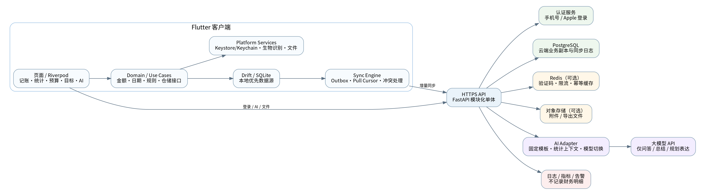
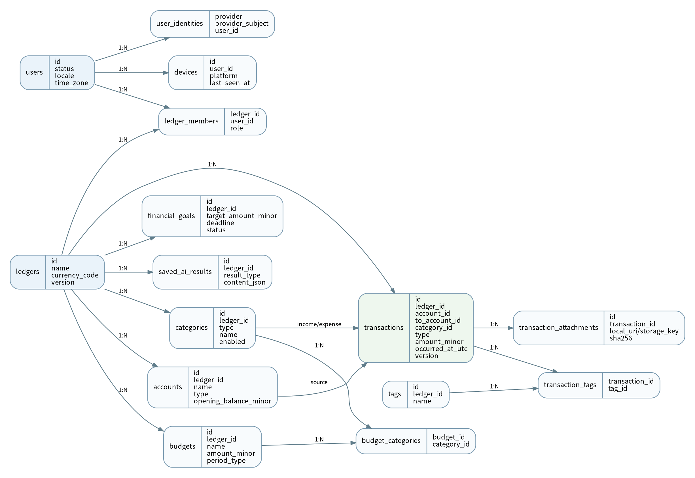
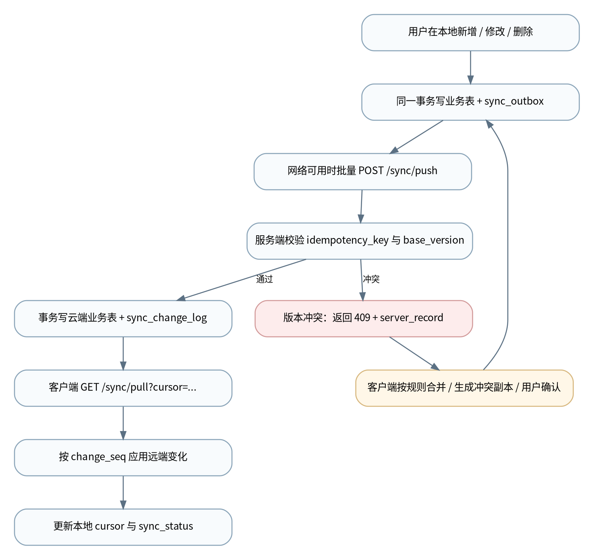
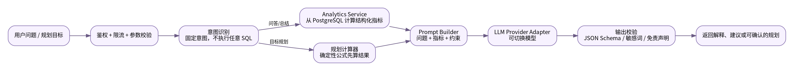

**智能记账 APP**
**数据库设计 V2、技术架构与开发路线**
Flutter + 后端 + 云同步 + AI 问答/规划接口
| 文档版本 | V1.0（数据库模型版本 V2） |
| --- | --- |
| 编制日期 | 2026-08-02 |
| 文档状态 | 可进入技术评审与开发拆解 |
| 目标平台 | Android、iOS |
| 客户端路线 | Flutter 单代码库 |
| 后端路线 | FastAPI 模块化单体 + PostgreSQL |
| AI边界 | 问答、总结、规划表达；不建设 Agent、记忆系统或 RAG |
*产品原则：先把记账、数据安全和同步做好；AI只做轻量增强，不反客为主。*
# 文档控制
| 版本 | 日期 | 内容 | 状态 |
| --- | --- | --- | --- |
| V1.0 | 2026-08-02 | 基于双端重构方案与产品 PRD，新增云同步、数据库 V2、后端与轻量 AI 接口，并形成可执行任务拆解。 | 评审版 |
# 目录
1. 文档概述与关键决策
2. 数据架构与设计原则
3. 数据模型总览
4. 本地数据库设计（Drift / SQLite）
5. 云端数据库设计（PostgreSQL）
6. 约束、索引与数据一致性
7. 本地与云端增量同步设计
8. 旧 Android 数据迁移与备份恢复
9. 总体技术架构
10. Flutter 客户端技术架构
11. FastAPI 后端技术架构
12. API 规范与接口清单
13. AI 问答与规划接口设计
14. 安全、隐私与合规设计
15. 部署、可观测性与 CI/CD
16. 测试体系与质量门禁
17. 开发路线、里程碑与排期
18. 详细任务拆解（WBS）
19. 风险登记与发布验收
附录 A：核心错误码
附录 B：开发与 Codex 执行规范
# 1. 文档概述与关键决策
## 1.1 背景与来源
本文件承接现有 Kotlin + Jetpack Compose Android 离线记账 MVP，并沿用原双端重构方案中已确定的 Flutter、Riverpod、Drift/SQLite、跨平台备份、版本化迁移和双商店发布方向。在此基础上，根据最新产品定位增加账号、云端数据保存、多设备增量同步，以及轻量 AI 问答与财务规划能力。
本设计以《智能记账 APP 产品需求文档（PRD）V1.0》为功能边界：记账是产品主体；云同步是可选数据模式；AI仅用于问答、消费解释、月度总结和规划建议，不引入复杂 Agent、长期记忆、RAG、向量数据库或任意 SQL 生成。
| 核心定位：这是“可离线使用并可选择云同步的记账 APP”，而不是以 AI 为主体的财务 Agent 产品。 |
| --- |
## 1.2 本次交付范围
- 数据库设计 V2：本地 SQLite 与云端 PostgreSQL 的逻辑模型、字段、约束、索引、迁移、备份和同步元数据。
- 技术架构设计：Flutter 客户端、FastAPI 后端、PostgreSQL、可选 Redis/对象存储、AI Provider Adapter、部署和 CI/CD。
- 接口设计：认证、同步、文件、AI 问答/规划、健康检查的 API 契约与错误模型。
- 开发路线和任务拆解：按阶段、依赖、交付物、验收标准和人日形成可直接执行的 WBS。
## 1.3 关键技术决策
| 决策项 | 正式决策 | 理由 |
| --- | --- | --- |
| 客户端 | Flutter 单代码库；Riverpod + Drift + go_router | 双端一致、1-2 人可维护、保留离线能力。 |
| 数据模式 | 本地优先；未登录为纯本地，登录后启用云端增量同步 | 不因网络失败阻塞记账，同时支持多设备。 |
| 云端架构 | FastAPI 模块化单体 + PostgreSQL | 第一版避免微服务和 Kubernetes 的运维复杂度。 |
| 同步 | 本地 Outbox + 服务端 Change Log + Cursor 拉取 | 可离线、可重试、可审计，适合增量同步。 |
| 冲突 | 版本号乐观锁；交易冲突保留副本，配置类按规则合并 | 避免静默覆盖财务数据。 |
| AI | 服务端聚合指标后调用 LLM；不允许 LLM 直接执行 SQL | 降低隐私、注入和错误查询风险。 |
| 规划 | 确定性计算器先计算，LLM 仅解释与润色 | 金额和期限结果可验证，不依赖模型“心算”。 |
| 部署 | 单区域 Docker 化部署，staging/prod 分离 | 控制早期成本，保留后续水平扩展能力。 |
## 1.4 V1.0 非目标
- 不做复杂 Agent、多 Agent 编排、长期记忆、RAG、向量数据库。
- 不做自动银行流水、短信抓取、OCR、小票识别和投资资产管理。
- 不做家庭共享账本、多人实时协同和会员订阅；数据模型仅预留 ledger\_members。
- 不让 AI 自动修改交易、预算或目标；所有写操作必须由用户确认。
- 不做实时强一致同步；目标是秒级至分钟级的最终一致。
- 不在首版使用 Kubernetes、服务网格或拆分微服务。
## 1.5 术语
| 术语 | 定义 |
| --- | --- |
| 本地模式 | 用户不登录，业务数据仅在设备 SQLite 中保存，可手动导出加密备份。 |
| 云同步模式 | 用户登录后，本地仍为工作数据源，服务端保存可跨设备恢复与同步的云端副本。 |
| Ledger（账本） | 交易、账户、分类、预算和目标的归属边界。V1 默认单账本。 |
| Outbox | 客户端本地待上传变更队列，与业务写入处于同一数据库事务。 |
| Change Log | 服务端按递增序号记录的同步变化流，客户端使用 Cursor 拉取。 |
| Tombstone | 软删除记录，用于将删除动作同步到其他设备。 |
| AI上下文 | 由后端基于用户授权范围计算的结构化财务指标，不等于全量原始账单。 |
# 2. 数据架构与设计原则
## 2.1 双模式数据架构
客户端无论是否登录，都首先写入本地 Drift/SQLite。登录后启用 Sync Engine，将本地增量上传到云端并拉取其他设备变化。页面不直接依赖网络结果，因此离线时新增、编辑、删除、统计和预算均可使用。

图 1  智能记账 APP 总体技术架构
| 数据源约定：设备内页面查询以本地数据库为准；云端是多设备交换和灾备副本，不是每次打开页面都远程查询的唯一数据源。 |
| --- |
## 2.2 数据设计原则
- 金额使用 64 位整数最小货币单位（如“分”），禁止使用 float/double 持久化与汇总。
- 业务主键统一使用 UUID，由客户端生成，确保离线创建和跨设备幂等。
- 时间同时保存 UTC 时间与原始时区 ID，账单分组按发生时区计算。
- 同步对象统一包含 version、updated\_at、deleted\_at 和 last\_modified\_device\_id。
- 分类、账户等被历史交易引用后只允许禁用；交易删除采用软删除并同步 Tombstone。
- 数据库变更必须有 Schema 版本、迁移脚本、Fixture、正向升级测试和回滚/不可回滚说明。
- 用户财务明细不进入普通日志；AI日志默认只保存模型、Token、延迟和状态，不保存问题与回答正文。
- 本地模式可无账号完整使用；从本地模式升级为云同步模式时执行绑定、上传、对账和可回滚迁移。
## 2.3 数据类型映射
| 逻辑类型 | SQLite / Drift | PostgreSQL | 说明 |
| --- | --- | --- | --- |
| UUID | TEXT | UUID | 客户端生成，规范为小写带连字符。 |
| 金额 | INTEGER | BIGINT | 单位为分；业务值要求大于等于 0。 |
| UTC时间 | INTEGER（毫秒） | TIMESTAMPTZ | API 使用 RFC 3339；本地存 epoch ms。 |
| 时区 | TEXT | VARCHAR(64) | IANA 时区，例如 Asia/Shanghai。 |
| 布尔 | INTEGER 0/1 | BOOLEAN | 由仓储层完成映射。 |
| 枚举 | TEXT + CHECK | VARCHAR + CHECK | 首版避免数据库 ENUM 带来的迁移负担。 |
| JSON | TEXT | JSONB | 必须有应用层 JSON Schema 校验。 |
| 版本号 | INTEGER | BIGINT | 每次服务端成功写入递增。 |
## 2.4 数据分级
| 级别 | 示例 | 存储与日志要求 |
| --- | --- | --- |
| S1 高敏感 | 交易金额、备注、账户、预算、财务目标、AI上下文 | 本地加密；TLS；云端最小权限；禁止写普通日志。 |
| S2 身份数据 | 手机号、邮箱、Apple subject、设备标识 | 字段级脱敏显示；访问审计；按账号注销策略删除。 |
| S3 技术数据 | 版本号、同步游标、错误码、Token消耗 | 可进入受控日志，但不得通过关联还原财务明细。 |
| S4 公共配置 | 应用版本、分类图标字典、功能开关 | 可缓存与公开分发。 |
# 3. 数据模型总览

图 2  数据模型 V2 核心实体关系（简化）
## 3.1 业务实体与职责
| 实体 | 职责 | V1处理方式 |
| --- | --- | --- |
| users / user_identities | 云同步账号与登录身份映射 | 仅云端；本地模式不创建用户。 |
| devices | 设备注册、同步来源、最后活跃版本 | 登录后注册；退出登录保留本地数据。 |
| ledgers | 账本边界、币种与默认设置 | V1 默认单账本，不写死 ID=1。 |
| ledger_members | 账本与用户关系 | V1 仅 owner；为后续共享账本预留。 |
| accounts | 现金、银行卡、第三方支付等账户 | V1 UI 可默认“默认账户”，为转账和余额预留。 |
| categories | 收入/支出分类、排序和禁用 | 有引用时禁止物理删除。 |
| transactions | 收入、支出、转账和备注 | 核心事实表；转账不计入收入/支出统计。 |
| tags / transaction_tags | 交易标签与多对多关系 | 可选使用，支持搜索和统计。 |
| budgets / budget_categories | 总预算和分类预算 | 按月/自定义周期计算使用额。 |
| financial_goals | 储蓄、买车、旅行等目标 | 支持确定性计划计算。 |
| saved_ai_results | 用户主动保存的月报或规划结果 | AI对话默认不持久化；仅保存确认结果。 |
| sync_outbox / sync_change_log | 客户端上传队列与服务端变化流 | 支撑离线增量同步。 |
## 3.2 同步基础字段
| 字段 | 类型 | 适用范围 | 规则 |
| --- | --- | --- | --- |
| id | UUID | 全部业务实体 | 由客户端生成，服务端不得改写。 |
| created_at | UTC时间 | 全部业务实体 | 首次创建时间，不随同步变化。 |
| updated_at | UTC时间 | 全部业务实体 | 本地修改时间；服务端接受后返回 server_updated_at。 |
| deleted_at | UTC时间/空 | 可删除实体 | 非空即 Tombstone，页面默认过滤。 |
| version | BIGINT | 云端同步实体 | 服务端单行版本；创建后从 1 开始。 |
| last_modified_device_id | UUID | 同步实体 | 记录最后写入来源。 |
| sync_status | 枚举 | 仅本地 | synced / pending / conflict / failed。 |
# 4. 本地数据库设计（Drift / SQLite）
## 4.1 本地数据库职责
- 承载全部页面查询和核心业务写入，网络不可用时仍可完成记账。
- 保存同步 Outbox、Pull Cursor、冲突状态和迁移日志。
- 保存设备侧安全设置的非秘密部分；PIN派生材料与数据库密钥由 Keystore/Keychain 管理。
- 可导出为跨平台 .ledgerbackup；恢复时先导入临时数据库，再原子替换。
| 字段说明：所有同步业务表默认包含：id、created_at_ms、updated_at_ms、deleted_at_ms、version、last_modified_device_id、sync_status。以下表格重点列业务字段，基础字段按同步基础字段统一实现。 |
| --- |
### 4.2 local\_profile
| 字段 | SQLite类型 | 可空 | 默认 | 说明 |
| --- | --- | --- | --- | --- |
| id | TEXT | 否 | 固定 local | 本地匿名资料标识，不上传 |
| display_name | TEXT | 是 | NULL | 可选昵称 |
| created_at_ms | INTEGER | 否 | - | 本地资料创建时间 |
| cloud_user_id | TEXT | 是 | NULL | 登录后绑定的云端 user_id |
### 4.3 ledgers
| 字段 | SQLite类型 | 可空 | 默认 | 说明 |
| --- | --- | --- | --- | --- |
| id | TEXT | 否 | UUID | 账本ID |
| name | TEXT | 否 | 默认账本 | 账本名称 |
| currency_code | TEXT | 否 | CNY | ISO 4217 货币代码 |
| time_zone_id | TEXT | 否 | 设备时区 | 默认分组时区 |
| is_default | INTEGER | 否 | 1 | V1 仅一个默认账本 |
| settings_json | TEXT | 是 | NULL | 账本级非敏感扩展设置 |
### 4.4 accounts
| 字段 | SQLite类型 | 可空 | 默认 | 说明 |
| --- | --- | --- | --- | --- |
| id | TEXT | 否 | UUID | 账户ID |
| ledger_id | TEXT | 否 | - | 所属账本 |
| name | TEXT | 否 | - | 现金/银行卡/支付宝等 |
| account_type | TEXT | 否 | cash | cash/bank/wallet/other |
| opening_balance_minor | INTEGER | 否 | 0 | 期初余额，单位分 |
| icon_code | TEXT | 是 | NULL | 跨端图标编码 |
| sort_order | INTEGER | 否 | 0 | 排序 |
| enabled | INTEGER | 否 | 1 | 禁用后不可用于新交易 |
### 4.5 categories
| 字段 | SQLite类型 | 可空 | 默认 | 说明 |
| --- | --- | --- | --- | --- |
| id | TEXT | 否 | UUID | 分类ID |
| ledger_id | TEXT | 否 | - | 所属账本 |
| category_type | TEXT | 否 | - | income/expense |
| name | TEXT | 否 | - | 分类名称 |
| icon_code | TEXT | 是 | NULL | 跨端图标编码 |
| color_token | TEXT | 是 | NULL | 设计系统颜色Token |
| sort_order | INTEGER | 否 | 0 | 排序 |
| enabled | INTEGER | 否 | 1 | 有历史交易时只能禁用 |
| system_key | TEXT | 是 | NULL | 内置分类稳定标识 |
### 4.6 transactions
| 字段 | SQLite类型 | 可空 | 默认 | 说明 |
| --- | --- | --- | --- | --- |
| id | TEXT | 否 | UUID | 交易ID |
| ledger_id | TEXT | 否 | - | 所属账本 |
| transaction_type | TEXT | 否 | - | income/expense/transfer |
| account_id | TEXT | 否 | - | 来源账户 |
| to_account_id | TEXT | 是 | NULL | 转账目标账户 |
| category_id | TEXT | 是 | NULL | 收入/支出必填，转账为空 |
| amount_minor | INTEGER | 否 | - | 正整数，单位分 |
| occurred_at_utc_ms | INTEGER | 否 | - | 发生时间UTC毫秒 |
| time_zone_id | TEXT | 否 | - | 发生时区 |
| note | TEXT | 是 | NULL | 备注，建议最多500字 |
| merchant | TEXT | 是 | NULL | 商户，可选 |
| source_type | TEXT | 否 | manual | manual/import/ai_assisted |
| transfer_group_id | TEXT | 是 | NULL | 转账关联标识；当前设计单行转账可为空 |
### 4.7 tags
| 字段 | SQLite类型 | 可空 | 默认 | 说明 |
| --- | --- | --- | --- | --- |
| id | TEXT | 否 | UUID | 标签ID |
| ledger_id | TEXT | 否 | - | 所属账本 |
| name | TEXT | 否 | - | 标签名称 |
| color_token | TEXT | 是 | NULL | 展示颜色 |
| sort_order | INTEGER | 否 | 0 | 排序 |
### 4.8 transaction\_tags
| 字段 | SQLite类型 | 可空 | 默认 | 说明 |
| --- | --- | --- | --- | --- |
| transaction_id | TEXT | 否 | - | 交易ID |
| tag_id | TEXT | 否 | - | 标签ID |
| created_at_ms | INTEGER | 否 | - | 关联时间 |
### 4.9 transaction\_attachments
| 字段 | SQLite类型 | 可空 | 默认 | 说明 |
| --- | --- | --- | --- | --- |
| id | TEXT | 否 | UUID | 附件ID |
| transaction_id | TEXT | 否 | - | 关联交易 |
| local_uri | TEXT | 是 | NULL | 设备文件URI |
| storage_key | TEXT | 是 | NULL | 云端对象键 |
| mime_type | TEXT | 否 | - | MIME类型 |
| size_bytes | INTEGER | 否 | 0 | 文件大小 |
| sha256 | TEXT | 否 | - | 去重和完整性校验 |
| upload_status | TEXT | 否 | local_only | local_only/pending/uploaded/failed |
### 4.10 budgets
| 字段 | SQLite类型 | 可空 | 默认 | 说明 |
| --- | --- | --- | --- | --- |
| id | TEXT | 否 | UUID | 预算ID |
| ledger_id | TEXT | 否 | - | 所属账本 |
| name | TEXT | 否 | - | 预算名称 |
| amount_minor | INTEGER | 否 | - | 预算金额 |
| period_type | TEXT | 否 | monthly | monthly/custom |
| start_date_local | TEXT | 否 | - | YYYY-MM-DD |
| end_date_local | TEXT | 是 | NULL | 自定义周期结束日 |
| enabled | INTEGER | 否 | 1 | 是否启用 |
| alert_thresholds_json | TEXT | 是 | [0.8,1.0] | 提醒阈值 |
### 4.11 budget\_categories
| 字段 | SQLite类型 | 可空 | 默认 | 说明 |
| --- | --- | --- | --- | --- |
| budget_id | TEXT | 否 | - | 预算ID |
| category_id | TEXT | 否 | - | 分类ID |
| created_at_ms | INTEGER | 否 | - | 关联时间 |
### 4.12 financial\_goals
| 字段 | SQLite类型 | 可空 | 默认 | 说明 |
| --- | --- | --- | --- | --- |
| id | TEXT | 否 | UUID | 目标ID |
| ledger_id | TEXT | 否 | - | 所属账本 |
| name | TEXT | 否 | - | 目标名称 |
| target_amount_minor | INTEGER | 否 | - | 目标金额 |
| current_amount_minor | INTEGER | 否 | 0 | 当前已积累金额，可手动维护 |
| deadline_local | TEXT | 是 | NULL | YYYY-MM-DD |
| goal_type | TEXT | 否 | saving | saving/car/travel/education/other |
| status | TEXT | 否 | active | active/paused/completed/cancelled |
| plan_json | TEXT | 是 | NULL | 用户确认后的结构化计划 |
### 4.13 app\_settings
| 字段 | SQLite类型 | 可空 | 默认 | 说明 |
| --- | --- | --- | --- | --- |
| key | TEXT | 否 | - | 设置键 |
| value_type | TEXT | 否 | - | string/int/bool/json |
| value_text | TEXT | 是 | NULL | 序列化值 |
| updated_at_ms | INTEGER | 否 | - | 修改时间 |
| sync_scope | TEXT | 否 | device | device/account |
### 4.14 saved\_ai\_results
| 字段 | SQLite类型 | 可空 | 默认 | 说明 |
| --- | --- | --- | --- | --- |
| id | TEXT | 否 | UUID | 用户主动保存的AI结果 |
| ledger_id | TEXT | 否 | - | 所属账本 |
| result_type | TEXT | 否 | - | monthly_summary/plan/advice |
| title | TEXT | 否 | - | 标题 |
| period_start_local | TEXT | 是 | NULL | 分析开始日 |
| period_end_local | TEXT | 是 | NULL | 分析结束日 |
| content_json | TEXT | 否 | - | 结构化结果与展示文本 |
| source_metrics_hash | TEXT | 是 | NULL | 数据摘要哈希，便于识别过期 |
### 4.15 sync\_outbox
| 字段 | SQLite类型 | 可空 | 默认 | 说明 |
| --- | --- | --- | --- | --- |
| event_id | TEXT | 否 | UUID | 本地事件ID |
| entity_type | TEXT | 否 | - | 实体类型 |
| entity_id | TEXT | 否 | - | 实体ID |
| operation | TEXT | 否 | - | upsert/delete |
| base_version | INTEGER | 否 | 0 | 修改时已知服务端版本 |
| payload_json | TEXT | 否 | - | 完整或合并后的实体快照 |
| idempotency_key | TEXT | 否 | UUID | 服务端幂等键 |
| attempt_count | INTEGER | 否 | 0 | 重试次数 |
| next_retry_at_ms | INTEGER | 是 | NULL | 指数退避 |
| last_error_code | TEXT | 是 | NULL | 最后错误码 |
| created_at_ms | INTEGER | 否 | - | 创建时间 |
### 4.16 sync\_state
| 字段 | SQLite类型 | 可空 | 默认 | 说明 |
| --- | --- | --- | --- | --- |
| scope_key | TEXT | 否 | - | 例如 ledger:{id} |
| pull_cursor | INTEGER | 否 | 0 | 最后应用的 change_seq |
| last_success_at_ms | INTEGER | 是 | NULL | 最近成功同步 |
| bootstrap_completed | INTEGER | 否 | 0 | 是否完成初始快照 |
| full_resync_required | INTEGER | 否 | 0 | 游标过期或校验失败时置1 |
### 4.17 migration\_log
| 字段 | SQLite类型 | 可空 | 默认 | 说明 |
| --- | --- | --- | --- | --- |
| id | TEXT | 否 | UUID | 迁移记录 |
| from_version | INTEGER | 否 | - | 源版本 |
| to_version | INTEGER | 否 | - | 目标版本 |
| started_at_ms | INTEGER | 否 | - | 开始时间 |
| completed_at_ms | INTEGER | 是 | NULL | 完成时间 |
| status | TEXT | 否 | running | running/success/failed/rolled_back |
| result_hash | TEXT | 是 | NULL | 数量和金额摘要哈希 |
| error_code | TEXT | 是 | NULL | 失败错误码 |
# 5. 云端数据库设计（PostgreSQL）
## 5.1 云端数据库职责
- 保存登录用户的云端业务副本，支持多设备同步、云端恢复和 AI 统计查询。
- 维护身份、设备、会话、账本成员关系和同步 Change Log。
- 通过后端服务访问，移动端不得直连 PostgreSQL。
- 业务表使用 Alembic 管理版本；生产启用自动备份和时间点恢复能力。
## 5.2 业务表镜像规则
ledgers、accounts、categories、transactions、tags、transaction\_tags、transaction\_attachments、budgets、budget\_categories、financial\_goals、app\_settings、saved\_ai\_results 在云端与本地保持同一业务语义。云端将 UUID 映射为 PostgreSQL UUID、时间映射为 TIMESTAMPTZ、JSON 映射为 JSONB，并增加服务端 version、created\_at、updated\_at、deleted\_at、last\_modified\_device\_id。
| 所有权检查：后端每次业务访问必须先验证 user 是否为 ledger_members 的有效成员；V1 仅允许 owner。移动端不直接使用数据库级账号。 |
| --- |
### 5.3 users
| 字段 | PostgreSQL类型 | 约束 | 说明 |
| --- | --- | --- | --- |
| id | UUID | PK | 用户ID |
| status | VARCHAR(20) | NOT NULL | active/disabled/deleting |
| display_name | VARCHAR(80) | NULL | 昵称 |
| phone_e164 | VARCHAR(32) | NULL UNIQUE | 脱敏展示；可由身份服务管理 |
| email_normalized | VARCHAR(255) | NULL UNIQUE | 小写标准化 |
| locale | VARCHAR(16) | NOT NULL | 默认 zh-CN |
| time_zone_id | VARCHAR(64) | NOT NULL | 默认时区 |
| created_at | TIMESTAMPTZ | NOT NULL | 创建时间 |
| updated_at | TIMESTAMPTZ | NOT NULL | 修改时间 |
| deleted_at | TIMESTAMPTZ | NULL | 注销流程软删除 |
### 5.4 user\_identities
| 字段 | PostgreSQL类型 | 约束 | 说明 |
| --- | --- | --- | --- |
| id | UUID | PK | 身份记录ID |
| user_id | UUID | FK users | 关联用户 |
| provider | VARCHAR(30) | NOT NULL | phone/apple/google等 |
| provider_subject | VARCHAR(255) | NOT NULL | 第三方稳定subject |
| verified_at | TIMESTAMPTZ | NULL | 验证时间 |
| created_at | TIMESTAMPTZ | NOT NULL | 创建时间 |
| UNIQUE | (provider, provider_subject) | - | 同一身份只能绑定一个用户 |
### 5.5 auth\_sessions
| 字段 | PostgreSQL类型 | 约束 | 说明 |
| --- | --- | --- | --- |
| id | UUID | PK | 会话ID |
| user_id | UUID | FK users | 用户 |
| device_id | UUID | FK devices | 设备 |
| refresh_token_hash | VARCHAR(128) | NOT NULL | 只存哈希 |
| expires_at | TIMESTAMPTZ | NOT NULL | 过期时间 |
| revoked_at | TIMESTAMPTZ | NULL | 撤销时间 |
| created_at | TIMESTAMPTZ | NOT NULL | 创建时间 |
| last_used_at | TIMESTAMPTZ | NULL | 最近刷新 |
### 5.6 devices
| 字段 | PostgreSQL类型 | 约束 | 说明 |
| --- | --- | --- | --- |
| id | UUID | PK | 客户端生成设备ID |
| user_id | UUID | FK users | 所属用户 |
| platform | VARCHAR(20) | NOT NULL | android/ios |
| device_name | VARCHAR(120) | NULL | 用户可识别名称 |
| app_version | VARCHAR(32) | NOT NULL | 版本 |
| os_version | VARCHAR(32) | NULL | 系统版本 |
| push_token_encrypted | TEXT | NULL | 如启用推送则加密保存 |
| last_seen_at | TIMESTAMPTZ | NOT NULL | 最后活跃 |
| revoked_at | TIMESTAMPTZ | NULL | 用户移除设备 |
### 5.7 ledger\_members
| 字段 | PostgreSQL类型 | 约束 | 说明 |
| --- | --- | --- | --- |
| ledger_id | UUID | FK ledgers | 账本 |
| user_id | UUID | FK users | 用户 |
| role | VARCHAR(20) | NOT NULL | V1仅owner |
| joined_at | TIMESTAMPTZ | NOT NULL | 加入时间 |
| removed_at | TIMESTAMPTZ | NULL | 移除时间 |
| PRIMARY KEY | (ledger_id,user_id) | - | 唯一成员关系 |
### 5.8 sync\_change\_log
| 字段 | PostgreSQL类型 | 约束 | 说明 |
| --- | --- | --- | --- |
| change_seq | BIGSERIAL | PK | 全局递增游标 |
| user_id | UUID | NOT NULL | 变化可见用户 |
| ledger_id | UUID | NOT NULL | 所属账本 |
| entity_type | VARCHAR(40) | NOT NULL | 实体类型 |
| entity_id | UUID | NOT NULL | 实体ID |
| operation | VARCHAR(10) | NOT NULL | upsert/delete |
| entity_version | BIGINT | NOT NULL | 变化后的版本 |
| payload_json | JSONB | NOT NULL | 同步快照 |
| device_id | UUID | NULL | 来源设备 |
| changed_at | TIMESTAMPTZ | NOT NULL | 服务端时间 |
### 5.9 ai\_request\_logs
| 字段 | PostgreSQL类型 | 约束 | 说明 |
| --- | --- | --- | --- |
| id | UUID | PK | 请求ID |
| user_id | UUID | NOT NULL | 用户 |
| request_type | VARCHAR(30) | NOT NULL | ask/plan/monthly_summary |
| model_provider | VARCHAR(30) | NOT NULL | 供应商 |
| model_name | VARCHAR(80) | NOT NULL | 模型 |
| input_tokens | INTEGER | NOT NULL | 输入Token |
| output_tokens | INTEGER | NOT NULL | 输出Token |
| latency_ms | INTEGER | NOT NULL | 耗时 |
| status | VARCHAR(20) | NOT NULL | success/failed/rejected |
| error_code | VARCHAR(50) | NULL | 错误码 |
| created_at | TIMESTAMPTZ | NOT NULL | 请求时间 |
| 内容策略 | - | - | 默认不保存问题、原始账单和回答正文 |
### 5.10 idempotency\_records
| 字段 | PostgreSQL类型 | 约束 | 说明 |
| --- | --- | --- | --- |
| key | VARCHAR(80) | PK | 幂等键 |
| user_id | UUID | NOT NULL | 用户 |
| request_hash | VARCHAR(64) | NOT NULL | 请求摘要 |
| response_code | INTEGER | NULL | 响应状态 |
| response_body | JSONB | NULL | 短期缓存响应 |
| expires_at | TIMESTAMPTZ | NOT NULL | 过期时间 |
| created_at | TIMESTAMPTZ | NOT NULL | 创建时间 |
### 5.11 服务端业务表通用字段
| 字段 | 类型 | 规则 |
| --- | --- | --- |
| id | UUID | 主键；客户端生成。 |
| version | BIGINT | 每次成功写入 +1；创建为1。 |
| created_at | TIMESTAMPTZ | 服务端首次写入时间。 |
| updated_at | TIMESTAMPTZ | 服务端最终写入时间。 |
| deleted_at | TIMESTAMPTZ NULL | 软删除时间。 |
| last_modified_device_id | UUID NULL | 来源设备。 |
| legacy_id | BIGINT NULL | 旧 Android Long ID，仅迁移后保留。 |
# 6. 约束、索引与数据一致性
## 6.1 核心 CHECK 约束
| 对象 | 约束 |
| --- | --- |
| transactions.amount_minor | amount_minor > 0。 |
| transactions.type | 仅 income / expense / transfer。 |
| transactions 业务组合 | income/expense 必须有 category_id；transfer 必须有 to_account_id 且 source != target。 |
| categories.type | 仅 income / expense。 |
| budgets.amount_minor | amount_minor >= 0。 |
| financial_goals | target_amount_minor > 0；current_amount_minor >= 0。 |
| currency_code | 长度3，大写字母。 |
| time_zone_id | 非空；应用层用 IANA 数据库验证。 |
| note | 应用层最大500字符；导入时强制截断或拒绝。 |
## 6.2 关键索引
| 表 | 索引 | 用途 |
| --- | --- | --- |
| transactions | (ledger_id, occurred_at_utc DESC) WHERE deleted_at IS NULL | 月账单与最近交易。 |
| transactions | (ledger_id, category_id, occurred_at_utc) | 分类统计。 |
| transactions | (ledger_id, account_id, occurred_at_utc) | 账户流水与余额。 |
| transactions | (ledger_id, updated_at) | 增量查询和诊断。 |
| categories | UNIQUE(ledger_id, category_type, normalized_name) WHERE deleted_at IS NULL | 避免同类型重名。 |
| accounts | UNIQUE(ledger_id, normalized_name) WHERE deleted_at IS NULL | 避免账户重名。 |
| tags | UNIQUE(ledger_id, normalized_name) WHERE deleted_at IS NULL | 避免标签重名。 |
| ledger_members | (user_id, removed_at) | 查询用户可访问账本。 |
| sync_change_log | (user_id, change_seq) | 按游标拉取。 |
| sync_change_log | (ledger_id, entity_type, entity_id, change_seq DESC) | 诊断单实体变化。 |
| ai_request_logs | (user_id, created_at DESC) | 配额与成本统计。 |
## 6.3 统计口径
- 收入/支出统计仅包含未删除的 income/expense；transfer 不计入收入和支出。
- 按月统计使用交易 time\_zone\_id 将 occurred\_at\_utc 转换后分组，不能仅按服务器时区。
- 账户余额 = opening\_balance + 收入 - 支出 - 转出 + 转入；不直接保存可漂移的 current\_balance。
- 预算使用额默认只统计 expense，转账和收入不进入预算。
- 退款第一版可使用负向关联业务（单独 refund 类型）或支出冲正；正式编码前需在 P0 冻结口径。
## 6.4 数据一致性校验
| 校验 | 触发时机 | 失败处理 |
| --- | --- | --- |
| 外键完整性 | 本地恢复、服务端写入、迁移 | 拒绝写入；恢复保持原库不变。 |
| 记录数量 | 迁移/全量恢复/全量重同步 | 输出差异清单，不自动宣告成功。 |
| 月度收入/支出汇总 | 迁移和恢复 | 逐月金额必须一致。 |
| 重复 UUID | 同步 push | 按 idempotency 和版本判断，不重复插入。 |
| 附件 SHA-256 | 上传和下载 | 不一致则删除临时文件并重试。 |
| 同步游标连续性 | pull 应用后 | 发现缺口则停止并触发全量快照。 |
# 7. 本地与云端增量同步设计
## 7.1 同步目标
- 离线写入立即成功，不因网络或云端故障阻塞记账。
- 同一变更可安全重试，不产生重复交易。
- 多设备最终一致；不静默丢失发生冲突的财务记录。
- 删除可传播；旧设备上线后不会把已删除数据重新创建。
- 同步可诊断、可全量重建、可在游标过期后恢复。

图 3  增量同步写入、上传、拉取与冲突处理
## 7.2 本地写入事务
| BEGIN LOCAL TRANSACTION   1. INSERT/UPDATE 业务表   2. 设置 sync_status = 'pending'   3. INSERT sync_outbox(event_id, entity_id, operation,                         base_version, payload_json, idempotency_key) COMMIT |
| --- |
业务数据与 Outbox 必须在同一 SQLite 事务提交。禁止先写业务表、再异步补写队列，否则 App 崩溃时会产生永远无法上传的本地数据。
## 7.3 Push 协议
| 步骤 | 规则 |
| --- | --- |
| 批次 | 一次最多 100 条或 512KB；按 event 创建顺序发送。 |
| 幂等 | 每个事件带 idempotency_key；服务端重复收到时返回原结果。 |
| 乐观锁 | 更新/删除必须带 base_version；服务端当前版本不一致返回 409。 |
| 事务 | 同一实体的写入和 change_log 追加在一个 PostgreSQL 事务中完成。 |
| 部分失败 | 响应逐条返回状态；成功项本地删除 Outbox，失败项保留并退避。 |
| 顺序 | 同一实体的多个本地变更在发送前合并为最新快照，减少无效历史。 |
## 7.4 Pull 协议
| 步骤 | 规则 |
| --- | --- |
| 游标 | 客户端保存每个用户/账本的 pull_cursor。 |
| 查询 | GET /v1/sync/pull?cursor=123&limit=500。 |
| 应用 | 按 change_seq 递增在一个本地事务中应用。 |
| 本地待修改 | 如果远端变化命中本地 pending 记录，进入冲突判断，不直接覆盖。 |
| 提交游标 | 仅在整批成功应用后更新 cursor。 |
| 游标过期 | 服务端返回 SYNC_CURSOR_EXPIRED，客户端请求 snapshot 全量重建。 |
## 7.5 冲突处理规则
| 实体类型 | 默认策略 | 用户体验 |
| --- | --- | --- |
| transactions | 若两端都修改同一记录，保留服务端版本，同时创建“冲突副本”供用户选择 | 绝不静默覆盖金额、时间或分类。 |
| budgets / goals | 按字段合并；同字段冲突使用更新时间并保留差异摘要 | 提示“已在其他设备修改”，用户可撤销。 |
| categories / accounts / tags | 名称冲突自动追加设备后缀并标记待确认 | 避免同步失败阻塞其他记录。 |
| app_settings | device 范围不上传；account 范围按更新时间覆盖 | 主题等可同步，生物识别设置不得同步。 |
| delete vs update | 删除优先，但保存本地更新为可恢复草稿 | 用户可恢复为新 UUID。 |
## 7.6 本地模式升级到云同步模式
- 用户登录并完成云账号认证。
- 客户端冻结一次本地快照，生成记录数和月度收支摘要。
- 服务端创建默认账本和设备绑定，客户端决定“上传本地账本”或“合并云端账本”。
- 本地所有业务记录保持原 UUID，批量写入 Outbox 并上传。
- 服务端完成写入后返回云端摘要；客户端逐月对账。
- 对账通过后标记 bootstrap\_completed；失败时保留本地数据并允许重试，不清空本地库。
## 7.7 退出登录与设备移除
- 退出登录先尝试完成 pending 同步；存在未同步数据时必须明确提示。
- 退出后撤销 refresh session，清除 Token，但默认保留本地账本供离线使用。
- 用户可选择“仅退出”“退出并清除本机云数据”；后者需要二次确认和生物识别。
- 移除其他设备只撤销其会话，不直接删除账本数据。
# 8. 旧 Android 数据迁移与备份恢复
## 8.1 旧模型到 V2 的映射
| 旧来源 | V2目标 | 转换规则 |
| --- | --- | --- |
| books | ledgers | 旧 Long ID 写入 legacy_id；生成 UUID；币种默认 CNY。 |
| categories | categories | 保留类型、名称、图标、排序；有历史引用的分类不可物理删除。 |
| transactions | transactions | 金额转为 amount_minor；记录发生时区；默认映射至“默认账户”。 |
| DataStore 总预算/预算项 JSON | budgets + budget_categories | 解析 JSON 并建立结构化关联。 |
| DataStore 普通设置 | app_settings | 仅迁移非秘密设置。 |
| PIN/生物识别/Keystore密钥 | 不迁移 | 新 App 要求重新配置设备安全。 |
| 旧 .zip.enc | V1 导入器 | 明确提示其不包含预算和部分设置。 |
## 8.2 迁移门禁
- 迁移前创建设备加密的旧数据库回滚快照。
- 迁移在临时数据库执行；正式库在成功健康检查前不得覆盖。
- 按账本、分类、交易、预算数量及逐月收入/支出总额对账。
- 迁移重复执行必须幂等：同一 legacy\_id 不得重复创建。
- 迁移失败时保留旧数据保护页，可重试、导出诊断摘要或继续使用桥接版本。
## 8.3 跨平台备份 V2
| 项目 | 设计 |
| --- | --- |
| 扩展名 | .ledgerbackup |
| 加密 | PBKDF2-HMAC-SHA256 派生 + AES-256-GCM；每份备份随机盐与 Nonce。 |
| 内容 | manifest、ledgers、accounts、categories、transactions.jsonl、budgets、goals、settings、checksums。 |
| 排除 | PIN、生物识别授权、设备密钥、Token、云端会话。 |
| 恢复 | 解密到临时目录 → 校验 → 导入临时库 → 对账 → 用户确认 → 原子切换。 |
| 跨端 | Android 生成/iOS 恢复与反向恢复必须有固定测试向量。 |
# 9. 总体技术架构
## 9.1 架构风格
V1.0 采用“Flutter 本地优先客户端 + FastAPI 模块化单体 + PostgreSQL + 可选 Redis/对象存储 + 外部大模型 API”的架构。客户端和后端均按业务模块分层，但不拆微服务。只有当用户量、团队规模或独立扩容需求出现时，才考虑拆分 AI、同步或文件服务。
| 避免过度设计：V1 不使用 Kubernetes、消息总线、向量数据库、复杂工作流引擎和多 Agent。Redis、对象存储和后台 Worker均按功能需要启用。 |
| --- |
## 9.2 主要运行链路
| 场景 | 运行链路 |
| --- | --- |
| 新增记账 | Flutter UI → Use Case → Drift 事务 → 页面立即刷新 → Outbox 后台同步。 |
| 查看统计 | 页面 → 本地统计 DAO；无需等待云端。 |
| 多设备同步 | Sync Engine → FastAPI Sync → PostgreSQL + Change Log → 其他设备 Pull。 |
| AI问答 | Flutter → AI API → 权限校验 → 结构化统计 → LLM → 输出校验 → App。 |
| 目标规划 | Flutter → Planning API → 确定性计算器 → LLM解释 → 用户确认后写本地 Goal/Plan。 |
| 备份恢复 | 平台文件服务 → 解密/校验 → 临时数据库 → 对账 → 原子切换。 |
# 10. Flutter 客户端技术架构
## 10.1 推荐仓库结构
| apps/   mobile/                     # Android/iOS 壳、flavor、路由入口 packages/   app_shell/                  # 启动、安全门、导航、生命周期   design_system/              # 颜色、字体、间距、组件、图标   domain/                     # 实体、值对象、用例、仓储接口   data_local/                 # Drift schema、DAO、Migration   data_remote/                # Dio、DTO、API Client   sync_engine/                # Outbox、Pull Cursor、冲突处理   feature_dashboard/   feature_transactions/   feature_statistics/   feature_budget/   feature_goals/   feature_ai/   feature_account/   feature_settings/   backup/                     # .ledgerbackup 导入导出   platform_services/          # 文件、分享、生物识别、安全窗口   observability/              # 隐私受控日志、崩溃与性能   testing/                    # Fixture、Fake、Golden、E2E 工具 tools/   legacy_migration/ docs/ |
| --- |
## 10.2 分层与依赖方向
| 层 | 职责 | 禁止事项 |
| --- | --- | --- |
| Presentation | Widget、页面状态、输入校验、导航 | 不得直接访问 SQLite、Dio 或平台通道。 |
| Application | Riverpod Notifier、Use Case 编排、事务边界 | 不得包含平台特定实现。 |
| Domain | Money、Transaction、Budget、Goal、仓储接口、规则 | 不依赖 Flutter、Drift、HTTP。 |
| Data Local | Drift 表、DAO、Repository 实现、Migration | 不处理 UI 文案。 |
| Data Remote | API DTO、认证刷新、错误映射 | 不得成为页面唯一数据源。 |
| Sync Engine | Outbox、Push/Pull、Cursor、冲突 | 不得绕过 Repository 修改业务表。 |
| Platform Services | Keychain/Keystore、生物识别、文件、后台任务 | 通过接口暴露，业务层不直接依赖插件。 |
## 10.3 关键客户端组件
| 组件 | 建议 | 验收要点 |
| --- | --- | --- |
| 状态管理 | Riverpod；按 feature 暴露 Provider | 状态可测试；不使用全局可变单例。 |
| 数据库 | Drift + SQLite；SQLCipher 先做 POC | 迁移、事务、10万条查询性能通过。 |
| 网络 | Dio 或等价客户端；统一拦截器 | Token刷新只执行一次；错误映射稳定。 |
| 路由 | go_router；登录与安全门分离 | 锁状态确定前不绘制账单页面。 |
| 序列化 | json_serializable/freezed 或等价 | DTO 与 Domain 解耦；未知字段兼容。 |
| 安全存储 | flutter_secure_storage + 原生封装 | Token、数据库密钥不落普通偏好。 |
| 生物识别 | local_auth + 安全门 | 只解锁本机密钥，不作为云端身份。 |
| 后台同步 | Android WorkManager / iOS BGTaskScheduler | 不能承诺 iOS 固定时刻执行；前台启动也触发。 |
| 图表 | 经过许可证和性能审查的 Flutter 图表库 | 暗色、大字体、小屏通过。 |
## 10.4 启动状态机
| Booting   -> LoadSecureSettings   -> DatabaseMigration   -> AppLockRequired ? Locked : Ready   -> AuthSessionRestore   -> SyncBootstrap (non-blocking)   -> MainShell  任何失败：进入可恢复错误页，不先展示财务内容。 |
| --- |
## 10.5 页面与数据源约定
| 页面 | 主数据源 | 网络依赖 |
| --- | --- | --- |
| 首页/账单/统计/预算/目标 | 本地 Drift 查询 | 无；后台同步不阻塞展示。 |
| 登录/设备管理 | 后端 API | 需要网络。 |
| AI助手 | 后端 AI API | 需要网络；离线显示不可用提示。 |
| 备份/恢复/导出 | 本地数据库与平台文件服务 | 无；云附件下载除外。 |
| 同步状态 | sync_outbox + sync_state | 网络可用时刷新。 |
# 11. FastAPI 后端技术架构
## 11.1 模块化单体结构
| backend/   app/     main.py     core/             # 配置、日志、错误、鉴权依赖     auth/             # 手机号/Apple登录、会话、设备     users/     ledgers/     sync/             # push、pull、snapshot、冲突     analytics/        # 统计口径与结构化指标     ai/               # Provider Adapter、Prompt、输出校验     files/            # 附件上传签名与元数据     operations/       # 健康检查、后台任务、内部工具     db/               # SQLAlchemy、Alembic、事务   tests/   alembic/   docker/ |
| --- |
## 11.2 技术组件
| 组件 | 选择 | 说明 |
| --- | --- | --- |
| Web框架 | FastAPI | 异步接口、OpenAPI、Pydantic校验。 |
| ORM/迁移 | SQLAlchemy 2 + Alembic | 显式事务；迁移可回滚或注明不可回滚。 |
| 数据库 | PostgreSQL | 主业务库、Change Log、统计查询。 |
| 缓存/限流 | Redis（可选但推荐） | 验证码状态、限流、幂等短缓存；不作为业务事实源。 |
| 对象存储 | S3兼容服务（附件启用时） | 服务端下发短期上传/下载签名。 |
| 后台任务 | V1优先轻量 Worker/Cron | 月报预生成、清理、备份；无必要不引入 Celery。 |
| API文档 | OpenAPI + 版本化示例 | CI校验契约变化。 |
| 配置 | 环境变量 + Secret 管理 | 禁止提交 .env 生产密钥。 |
## 11.3 后端事务边界
- 同步单事件：校验权限和版本 → 写业务表 → 追加 change\_log → 提交；任何一步失败整体回滚。
- 用户注册：映射身份 → 创建用户 → 创建默认账本/成员 → 注册设备 → 创建会话，要求幂等。
- AI请求：先鉴权和配额 → 只读统计事务 → 调用模型；模型失败不得影响业务数据。
- 附件：元数据记录与对象上传采用两阶段状态；只有 sha256 校验通过才标记 uploaded。
## 11.4 认证与会话
- 手机号登录由短信服务商完成验证码发送；后端只接收验证结果或短期验证码状态。
- Apple 登录由客户端获取 identity token，后端校验 issuer、audience、nonce 和签名。
- 后端签发短时 Access Token 与可轮换 Refresh Token；Refresh Token 仅存哈希。
- 刷新时执行 rotation：旧 token 立即失效；检测重复使用则撤销整条 session。
- 每个设备独立 session，用户可在“设备管理”中远程撤销。
# 12. API 规范与接口清单
## 12.1 通用约定
| 项目 | 约定 |
| --- | --- |
| Base URL | /api/v1 |
| 协议 | HTTPS；JSON UTF-8。 |
| 认证 | Authorization: Bearer <access_token>。 |
| 追踪 | X-Request-Id；服务端返回同一ID。 |
| 幂等 | 创建、同步、AI保存等写接口支持 Idempotency-Key。 |
| 分页 | cursor 优先，避免 offset 在大表漂移。 |
| 时间 | RFC 3339 UTC；业务日期另传 YYYY-MM-DD。 |
| 错误 | 统一 code/message/details/request_id；message 可展示，details 用于调试。 |
| 版本 | 破坏性变化升 /v2；新增可选字段保持向后兼容。 |
## 12.2 认证与用户接口
| 方法 | 路径 | 用途 |
| --- | --- | --- |
| POST | /auth/phone/request-code | 请求短信验证码。 |
| POST | /auth/phone/verify | 验证并登录/注册。 |
| POST | /auth/apple | Apple 登录。 |
| POST | /auth/refresh | 轮换 Access/Refresh Token。 |
| POST | /auth/logout | 撤销当前会话。 |
| GET | /me | 获取当前用户。 |
| GET | /me/devices | 设备列表。 |
| DELETE | /me/devices/{device_id} | 撤销指定设备。 |
| DELETE | /me | 发起账号注销。 |
## 12.3 同步接口
| 方法 | 路径 | 用途 |
| --- | --- | --- |
| POST | /sync/bootstrap | 首次登录或全量重同步，返回快照和初始 cursor。 |
| POST | /sync/push | 批量上传 Outbox 事件，逐条返回成功/冲突/失败。 |
| GET | /sync/pull | 按 cursor 拉取变化。 |
| POST | /sync/ack | 可选：客户端确认已应用游标，用于运维统计。 |
| GET | /sync/status | 返回服务端时间、最新游标和账号同步状态。 |
## 12.4 文件与AI接口
| 方法 | 路径 | 用途 |
| --- | --- | --- |
| POST | /files/upload-intent | 获取附件上传签名与 storage_key。 |
| POST | /files/{id}/complete | 提交 sha256 与大小，确认上传。 |
| GET | /files/{id}/download-url | 获取短期下载地址。 |
| POST | /ai/ask | 基于结构化指标回答财务问题。 |
| POST | /ai/plan | 生成目标规划；先确定性计算再解释。 |
| POST | /ai/monthly-summary | 生成指定月份总结。 |
| POST | /ai/results/{id}/save | 将用户确认结果保存并进入同步。 |
| GET | /ai/usage | 返回当前配额与使用量。 |
## 12.5 Push 请求示例
| POST /api/v1/sync/push Idempotency-Key: batch-uuid {   "device_id": "...",   "events": [     {       "event_id": "...",       "entity_type": "transaction",       "entity_id": "...",       "operation": "upsert",       "base_version": 3,       "idempotency_key": "...",       "payload": { "amount_minor": 3500, "...": "..." }     }   ] } |
| --- |
## 12.6 统一错误响应
| {   "code": "SYNC_VERSION_CONFLICT",   "message": "该记录已在其他设备修改",   "details": {     "entity_id": "...",     "server_version": 4,     "server_record": { "...": "..." }   },   "request_id": "req_..." } |
| --- |
# 13. AI 问答与规划接口设计
## 13.1 AI能力边界
| 明确不做：不建设记忆系统、RAG、向量数据库、多 Agent、工作流编排，也不允许模型直接访问数据库或自动修改账单。 |
| --- |
- 支持：消费原因解释、指定期间收支问答、月度总结、预算建议、储蓄目标规划。
- 不支持：投资荐股、贷款审批、税务/法律结论、医疗建议和保证收益。
- AI输出属于辅助建议，页面需要显示非专业财务建议免责声明。
- 所有写入预算/目标的操作必须展示可编辑预览，由用户点击确认。

图 4  轻量 AI 问答与规划处理链路
## 13.2 AI问答流程
- 客户端提交 question、ledger\_id、可选日期范围和当前页面上下文。
- 后端鉴权、限流并识别固定意图，例如“本月为何增加”“某分类花费”“储蓄率”。
- Analytics Service 使用预定义 SQL 查询结构化指标；不将用户问题转换为任意 SQL。
- Prompt Builder 仅拼接必要指标、口径说明、禁止事项和输出 Schema。
- Provider Adapter 调用配置的大模型，支持供应商切换和超时/重试。
- 输出按 JSON Schema 校验，失败时最多修复一次；仍失败返回可解释错误。
- 客户端展示回答和数据区间；默认不把对话作为长期记忆。
## 13.3 规划流程
规划结果中的关键数值由后端确定性计算器生成，模型只负责解释、提示约束和组织语言。例如目标储蓄所需月金额为：
| remaining = max(target_amount_minor - current_amount_minor, 0) months = number_of_months(today, deadline) required_monthly_saving = ceil(remaining / months) monthly_surplus = average_monthly_income - average_monthly_expense gap = required_monthly_saving - monthly_surplus |
| --- |
- 若 gap <= 0，给出可达结论和缓冲建议。
- 若 gap > 0，列出需要增加收入或削减支出的缺口，但不捏造用户没有的数据。
- 规划仅在用户确认后保存到 financial\_goals.plan\_json 或 saved\_ai\_results。
## 13.4 AI上下文最小化
| 场景 | 允许发送给模型 | 默认不发送 |
| --- | --- | --- |
| 消费解释 | 期间总收入/支出、分类汇总、同比环比、Top变化 | 逐笔备注、商户明细、手机号、账户名。 |
| 月度总结 | 月度汇总、预算使用率、目标进度 | 全量交易列表。 |
| 目标规划 | 收入均值、固定/可变支出汇总、目标金额与期限 | 身份信息、附件、历史聊天。 |
| 指定交易问答 | 必要的少量脱敏记录 | 其他无关账单。 |
## 13.5 AI请求契约
| POST /api/v1/ai/ask {   "ledger_id": "uuid",   "question": "我这个月为什么花得更多？",   "period": {"start": "2026-08-01", "end": "2026-08-31"},   "locale": "zh-CN" }  Response {   "answer": "...",   "facts": [     {"metric": "expense_total", "value_minor": 820000},     {"metric": "expense_mom_rate", "value": 0.23}   ],   "period": {"start": "...", "end": "..."},   "disclaimer": "该内容仅供个人预算参考" } |
| --- |
## 13.6 成本与可靠性控制
| 控制项 | 规则 |
| --- | --- |
| 超时 | 总超时 20-30 秒；模型超时不影响账本功能。 |
| 重试 | 仅网络/5xx重试一次；不得对用户重复计费。 |
| 限流 | 按用户、设备和 IP 组合限制；返回剩余配额。 |
| Token上限 | 上下文只传聚合指标；限制问题长度与输出长度。 |
| 降级 | 模型不可用时返回结构化统计和模板化建议。 |
| 供应商切换 | 统一 Provider Adapter；配置化模型名称和参数。 |
| 日志 | 记录请求ID、模型、Token、耗时、错误码；正文默认不落日志。 |
# 14. 安全、隐私与合规设计
## 14.1 客户端安全
- 数据库优先使用 SQLCipher/等价加密方案；P0 POC 不通过时至少使用系统文件保护、设备密钥和严格备份边界。
- 数据库密钥、Access/Refresh Token 存 Keystore/Keychain，不写入普通 SharedPreferences/UserDefaults。
- 应用启动先完成安全门判断，再构建财务页面；Android启用安全窗口，iOS后台覆盖敏感快照。
- PIN使用慢哈希与随机盐，失败次数和指数退避需持久化。
- 备份密码与应用 PIN 相互独立；忘记备份密码无法绕过解密。
## 14.2 服务端安全
| 领域 | 要求 |
| --- | --- |
| 传输 | 全站 TLS；HSTS；禁止明文HTTP。 |
| 鉴权 | 短时Access Token、Refresh轮换、设备会话撤销。 |
| 授权 | 所有业务访问校验 ledger_members；不得只相信客户端 user_id。 |
| 数据库 | 应用账号最小权限；生产只开放内网；备份加密。 |
| 秘密 | CI Secret/云Secret管理；密钥不得进入仓库、镜像或日志。 |
| 防滥用 | 验证码、登录、AI和上传接口限流；大小与类型白名单。 |
| 输入 | Pydantic校验、SQL参数化、JSON深度/长度限制。 |
| 依赖 | 锁版本、许可证检查、SCA扫描、定期升级。 |
## 14.3 用户数据权利
- 用户可导出完整账本为 .ledgerbackup 和可读格式。
- 用户可删除本机数据、撤销设备、发起账号注销和云端删除。
- 账号注销进入短暂可撤销期后，删除业务数据、附件和身份映射；备份按策略到期清理。
- AI使用、崩溃监控、推送和附件权限应在隐私政策与商店表单中明确披露。
# 15. 部署、可观测性与 CI/CD
## 15.1 环境与部署拓扑
| 环境 | 用途 | 数据规则 |
| --- | --- | --- |
| dev | 本地开发、Fixture、调试菜单 | 禁止使用真实生产用户数据。 |
| staging | 候选版本、迁移演练、TestFlight/Play内测 | 独立数据库与对象存储。 |
| prod | 正式用户 | 最小日志、严格Secret、备份与告警。 |
- V1 推荐 Docker Compose 或云托管容器：Nginx/负载入口、FastAPI、PostgreSQL、可选 Redis。
- 数据库启用每日全量备份与持续 WAL/PITR（按云服务能力配置）。
- 附件对象存储开启私有桶、短期签名URL、生命周期清理。
- 不使用 Kubernetes；达到多实例、弹性扩缩或独立团队维护需求后再评估。
## 15.2 可观测性
| 类型 | 指标/事件 | 隐私要求 |
| --- | --- | --- |
| 服务指标 | QPS、P95延迟、5xx、数据库连接、同步批次、AI耗时 | 不得含交易金额和备注。 |
| 业务健康 | 同步成功率、冲突率、迁移失败率、备份恢复失败率 | 只记录聚合数量。 |
| AI成本 | 调用数、Token、供应商错误、降级次数 | 默认不记录问题与回答正文。 |
| 移动端 | Crash-free、启动时间、数据库错误、同步状态 | 崩溃附件需脱敏。 |
| 告警 | 5xx、登录失败激增、同步积压、数据库容量、备份失败 | 告警消息不包含用户明细。 |
## 15.3 CI/CD流水线
| 流水线 | 必做检查 | 产物 |
| --- | --- | --- |
| Flutter PR | format、analyze、unit、widget、migration tests | 测试报告、覆盖率。 |
| Android Release | 签名AAB、混淆、依赖审查、安装/升级冒烟 | release.aab、mapping。 |
| iOS Release | test、archive、签名、隐私清单校验 | xcarchive/TestFlight。 |
| Backend PR | ruff/format、mypy、pytest、Alembic smoke、OpenAPI diff | Docker image、测试报告。 |
| Staging Deploy | 迁移预检、部署、health、E2E | 候选版本。 |
| Prod Deploy | 人工批准、备份确认、迁移、灰度、回滚门禁 | 正式版本与变更记录。 |
# 16. 测试体系与质量门禁
## 16.1 自动化测试层级
| 层级 | 范围 | 最低要求 |
| --- | --- | --- |
| Domain单元测试 | 金额、日期、预算、目标、统计规则 | 核心分支覆盖率≥80%。 |
| Drift数据库测试 | DAO、事务、索引、Migration、Outbox | 所有历史版本升级通过。 |
| 同步契约测试 | Push/Pull、幂等、冲突、游标过期、重试 | 服务端与客户端固定Fixture一致。 |
| Backend API测试 | 认证、授权、错误码、事务回滚 | 关键接口正反例齐全。 |
| AI测试 | 指标构造、Prompt快照、Schema校验、降级 | 金额计算不依赖LLM；敏感数据不进入上下文。 |
| Widget/Golden | 核心页面、空/错/暗色/大字体 | Android/iOS受控差异。 |
| E2E | 首次启动、记账、同步、冲突、备份、AI、退出登录 | 真机或云真机执行。 |
| 性能 | 10万交易查询、同步1000变化、冷启动 | 达到发布指标。 |
## 16.2 发布质量门槛
| 指标 | 门槛 |
| --- | --- |
| P0/P1缺陷 | 发布前为0。 |
| 核心业务单测覆盖率 | ≥80%。 |
| 迁移Fixture | 100%通过，记录数和逐月收支一致。 |
| 跨端备份恢复 | Android→iOS与iOS→Android真机通过。 |
| 同步幂等 | 同一批次重复提交不产生重复记录。 |
| 同步冲突 | 交易冲突不得静默覆盖。 |
| P95冷启动 | 中端设备≤2秒；安全门不泄露内容。 |
| 10万条月度查询 | 中端设备≤500ms。 |
| Crash-free users | 灰度期≥99.8%。 |
| 后端P95 | 非AI核心接口≤500ms（不含公网极端波动）。 |
| AI可用性 | 失败可降级；不影响记账、统计和同步。 |
# 17. 开发路线、里程碑与排期
## 17.1 推荐实施策略
推荐采用“先数据与迁移、再本地记账、再云同步、最后 AI 与商店发布”的顺序。同步和迁移属于高风险基础能力，不能等 UI 全部完成后再补。AI放在核心记账、统计和同步稳定之后接入。
## 17.2 里程碑
| 里程碑 | 主要结果 | 退出条件 | 建议周期 |
| --- | --- | --- | --- |
| M0 事实基线 | 源码、包名、签名、旧Schema、真实用户状态确认 | 全新环境可构建；匿名Fixture建立 | 1-2周 |
| M1 数据POC | Drift/SQLCipher、PostgreSQL模型、备份与同步POC | 双端打开同一备份；Push/Pull幂等通过 | 2-3周 |
| M2 本地核心完成 | 记账、账单、分类、账户、统计、预算、目标 | 离线E2E通过；10万数据性能达标 | 5-7周 |
| M3 云同步完成 | 登录、设备、Bootstrap、Push/Pull、冲突 | 双设备真机同步与恢复通过 | 4-6周 |
| M4 AI增强完成 | 问答、月报、规划、降级与配额 | 固定问题集准确；隐私检查通过 | 2-3周 |
| M5 Release Candidate | 迁移、安全、CI、商店材料、真机回归 | P0/P1=0；AAB/Archive可重复生成 | 3-4周 |
| M6 双端上线 | Play灰度、TestFlight/App Store、监控与回滚 | 指标稳定7天 | 1-2周 |
## 17.3 工期估算
| 团队 | 上线V1.0估算 | 说明 |
| --- | --- | --- |
| 1名熟悉Flutter+后端的全职开发者 | 24-32日历周 | 含云同步、AI、迁移、双商店；首次做iOS发布需增加缓冲。 |
| 2名开发者（Flutter + 后端/测试） | 15-20日历周 | 同步协议和数据模型必须共同评审，不能完全独立。 |
| 3名开发者（Flutter、后端、QA/发布） | 12-16日历周 | 适合并行真机、商店和自动化测试。 |
| 激进MVP | 12-16周（2人） | 需暂缓附件、标签、复杂冲突UI、自动月报等P1功能。 |
| 估算说明：AI辅助编码可以加速样板代码，但不能替代数据迁移、同步冲突、真机、签名、隐私和商店审核验证。 |
| --- |
## 17.4 并行工作流
| 工作流A：Flutter | 工作流B：后端/数据 | 共同门禁 |
| --- | --- | --- |
| 设计系统、页面、Drift、备份、安全门 | PostgreSQL、认证、同步、AI、部署 | Schema/API契约冻结 |
| 本地核心功能与UI测试 | Push/Pull与冲突契约测试 | 固定Fixture双向通过 |
| 登录、设备、同步状态UI | 会话、设备、Change Log | 双设备真机E2E |
| AI页面和结果确认 | Analytics、Prompt、Provider Adapter | 隐私与输出Schema |
| AAB/Archive与商店材料 | 生产部署、备份、告警 | RC发布清单 |
# 18. 详细任务拆解（WBS）
## 18.1 任务优先级定义
| 等级 | 含义 |
| --- | --- |
| P0 | 不完成则不能继续或不能上线：数据安全、核心记账、同步正确性、发布身份。 |
| P1 | V1.0正式体验需要：统计、预算、目标、AI基础、可观测性。 |
| P2 | 可推迟到V1.1/V1.5：附件云同步、更多第三方登录、自动月报等。 |
## P0 基线与冻结
| ID | 优先级 | 任务 | 交付物 | 依赖 | 验收标准 | 人日 |
| --- | --- | --- | --- | --- | --- | --- |
| P0-01 | P0 | 审计现有Android源码、Room、DataStore和APK | 源码事实清单、Schema、页面/功能矩阵 | 无 | 全新电脑能复现构建；文档事实与代码一致 | 2 |
| P0-02 | P0 | 确认真实用户、applicationId和正式签名 | 应用身份决策记录 | P0-01 | 能判断是否支持原地升级；密钥有受控备份 | 1 |
| P0-03 | P0 | 初始化Git、分支保护、README和贡献规范 | 可审计仓库 | P0-01 | clean clone一条命令构建 | 1 |
| P0-04 | P0 | 冻结V1范围与非目标 | 签字版范围清单 | PRD | 不含RAG/Agent/OCR/家庭账本 | 0.5 |
| P0-05 | P0 | 建立匿名真实Fixture和旧库哈希基线 | Fixture包与校验脚本 | P0-01 | 记录数、分类数、逐月金额可重复 | 2 |
| P0-06 | P0 | 冻结金额、时区、转账、退款统计口径 | 数据口径决策记录 | P0-04 | 产品、数据库、统计口径一致 | 1 |
| P0-07 | P0 | 准备Mac、iPhone、Android真机和开发者账号 | 发布环境清单 | 无 | 能创建测试包与TestFlight应用 | 1 |
| P0-08 | P0 | 建立风险登记、DoR/DoD和变更流程 | 项目治理模板 | P0-04 | 新增需求必须评审优先级和延期影响 | 0.5 |
## P1 数据与关键POC
| ID | 优先级 | 任务 | 交付物 | 依赖 | 验收标准 | 人日 |
| --- | --- | --- | --- | --- | --- | --- |
| P1-01 | P0 | 建立Flutter Monorepo骨架 | apps/packages目录与基础构建 | P0-03 | Android/iOS空壳均可运行 | 1.5 |
| P1-02 | P0 | 实现Drift最小Schema与Migration框架 | 可升级本地数据库 | P1-01 | v1→v2迁移测试通过 | 2 |
| P1-03 | P0 | 验证SQLCipher/数据库加密 | POC报告与决策 | P1-02 | 双端性能、密钥失效和恢复场景通过 | 2 |
| P1-04 | P0 | 实现PostgreSQL初始模型与Alembic | 0001_init迁移 | P0-06 | 升级/降级或不可降级说明完整 | 2 |
| P1-05 | P0 | 实现最小Outbox + Push/Pull POC | 同步原型 | P1-02,P1-04 | 重复提交不重复；离线重试成功 | 3 |
| P1-06 | P0 | 实现冲突POC | 交易冲突Fixture | P1-05 | 同记录双端修改不静默丢失 | 2 |
| P1-07 | P0 | 定义.ledgerbackup V2协议 | 协议文档与固定向量 | P0-05 | Android/iOS可互相解密与恢复 | 2 |
| P1-08 | P0 | 验证Keystore/Keychain、生物识别、文件分享 | 平台能力POC | P1-01 | 四项能力双端真机通过 | 2 |
| P1-09 | P1 | 验证AI Provider Adapter最小调用 | 模型适配POC | 后端骨架 | 超时、错误、JSON输出可控 | 1 |
| P1-10 | P0 | 冻结数据库V2和API v1契约 | 评审版Schema/OpenAPI | P1-01~09 | 后续破坏性改动需变更评审 | 1 |
## P2 工程基础与CI
| ID | 优先级 | 任务 | 交付物 | 依赖 | 验收标准 | 人日 |
| --- | --- | --- | --- | --- | --- | --- |
| P2-01 | P0 | 建立设计系统Token和基础组件 | 主题、字号、间距、按钮、表单 | P1-01 | 浅色/深色/大字体可用 | 2 |
| P2-02 | P0 | 建立Domain实体、Money和DateTime值对象 | domain包 | P1-10 | 无Flutter/数据库依赖；单测覆盖 | 2 |
| P2-03 | P0 | 建立Repository接口与依赖装配 | 仓储边界 | P2-02 | Feature不直接访问DAO/API | 1.5 |
| P2-04 | P0 | 建立统一错误、日志和隐私脱敏 | 错误码与logger | P1-10 | 日志不含金额、备注、Token | 1.5 |
| P2-05 | P0 | 建立dev/staging/prod flavor | 环境配置 | P1-01 | 包名、日志、API地址隔离 | 1 |
| P2-06 | P0 | 建立Flutter CI | format/analyze/test/build | P1-01 | PR必须通过门禁 | 1.5 |
| P2-07 | P0 | 建立Backend CI与Docker | pytest/mypy/migration/image | P1-04 | 镜像可在staging启动 | 1.5 |
| P2-08 | P1 | 建立OpenAPI生成和客户端DTO流程 | 契约自动化 | P1-10 | 契约变化可在CI检测 | 1 |
| P2-09 | P0 | 实现启动安全门状态机 | app_shell | P1-08 | 锁定前不绘制财务内容 | 2 |
## P3 本地记账核心
| ID | 优先级 | 任务 | 交付物 | 依赖 | 验收标准 | 人日 |
| --- | --- | --- | --- | --- | --- | --- |
| P3-01 | P0 | 实现账本和默认账户初始化 | 初始化Use Case | P2-02,P1-02 | 首次启动创建稳定默认数据 | 1 |
| P3-02 | P0 | 实现分类DAO、仓储和管理页 | 分类功能 | P3-01 | 新增/编辑/排序/禁用通过 | 2.5 |
| P3-03 | P0 | 实现账户DAO、仓储和管理页 | 账户功能 | P3-01 | 默认账户、禁用、余额口径通过 | 2.5 |
| P3-04 | P0 | 实现新增收入/支出/转账Use Case | 交易写入 | P3-02,P3-03 | 3秒记账主流程可用 | 3 |
| P3-05 | P0 | 实现快速记账页面与校验 | 记账UI | P3-04 | 金额、分类、时间、备注完整 | 3 |
| P3-06 | P0 | 实现账单列表、月份切换和分组 | 账单页 | P3-04 | 大数据分页/虚拟列表流畅 | 3 |
| P3-07 | P0 | 实现交易详情、编辑和软删除 | 详情页 | P3-06 | 删除进入Tombstone；可撤销窗口 | 2.5 |
| P3-08 | P1 | 实现搜索、筛选和标签 | 搜索功能 | P3-06 | 时间/分类/账户/文本组合筛选 | 3 |
| P3-09 | P1 | 实现首页Dashboard本地聚合 | 首页 | P3-04 | 本月收入/支出/结余正确 | 2.5 |
| P3-10 | P0 | 完成本地核心单测、数据库测试和E2E | 测试包 | P3-01~09 | 核心分支≥80%；离线全流程通过 | 3 |
## P4 统计、预算与目标
| ID | 优先级 | 任务 | 交付物 | 依赖 | 验收标准 | 人日 |
| --- | --- | --- | --- | --- | --- | --- |
| P4-01 | P1 | 实现日/月/年收支统计SQL | 统计DAO | P3-04 | 与Python/Fixture对账一致 | 2 |
| P4-02 | P1 | 实现趋势、分类排行和结构图表 | 统计页面 | P4-01 | 小屏、暗色、大字体通过 | 3 |
| P4-03 | P1 | 实现预算模型、CRUD和分类关联 | 预算数据层 | P3-02 | 总预算/分类预算事务正确 | 2.5 |
| P4-04 | P1 | 实现预算进度和阈值提醒 | 预算页面 | P4-03,P4-01 | 80%/100%提醒可配置 | 2 |
| P4-05 | P1 | 实现财务目标CRUD与进度 | 目标页面 | P3-09 | 金额、期限、状态流转正确 | 2 |
| P4-06 | P1 | 实现确定性规划计算器 | Planning Calculator | P4-05 | 边界月份、零期限、缺口测试通过 | 1.5 |
| P4-07 | P1 | 实现年度账单基础版 | 年度报告 | P4-01 | 年度总额、月份和Top分类正确 | 2 |
| P4-08 | P1 | 完成统计/预算/目标测试 | 测试包 | P4-01~07 | 关键口径Fixture 100%通过 | 2 |
## P5 认证、云端与同步
| ID | 优先级 | 任务 | 交付物 | 依赖 | 验收标准 | 人日 |
| --- | --- | --- | --- | --- | --- | --- |
| P5-01 | P0 | 实现用户、身份、设备、会话模型 | 认证数据层 | P1-04 | Alembic与约束通过 | 2 |
| P5-02 | P0 | 实现手机号验证码登录 | 认证API与App页面 | P5-01 | 限流、错误次数、过期通过 | 3 |
| P5-03 | P1 | 实现Apple登录 | Apple登录 | P5-01,P0-07 | 真机登录与注销通过 | 2.5 |
| P5-04 | P0 | 实现Access/Refresh轮换和设备撤销 | 会话服务 | P5-02 | 重复Refresh检测与撤销通过 | 2.5 |
| P5-05 | P0 | 实现ledger_members授权中间层 | 授权服务 | P5-01 | 越权接口全部返回403 | 1.5 |
| P5-06 | P0 | 实现Sync Bootstrap/Snapshot | 初始同步 | P1-05,P5-05 | 空云/有云两种模式可对账 | 3 |
| P5-07 | P0 | 实现Sync Push生产版 | Push API | P5-06 | 幂等、版本、部分失败通过 | 3 |
| P5-08 | P0 | 实现Sync Pull与Change Log | Pull API | P5-07 | Cursor、分页、游标过期通过 | 3 |
| P5-09 | P0 | 实现客户端Sync Engine和退避 | 后台同步 | P5-07,P5-08 | 断网/重启/重复提交可恢复 | 4 |
| P5-10 | P0 | 实现冲突中心与交易冲突副本 | 冲突UI | P1-06,P5-09 | 用户可比较、选择、恢复 | 3 |
| P5-11 | P0 | 实现本地模式升级云同步模式 | 绑定与上传流程 | P5-06~10 | 逐月金额对账；失败不清本地 | 3 |
| P5-12 | P1 | 实现同步状态、设备管理和退出策略 | 设置页面 | P5-04,P5-09 | 未同步数据提示准确 | 2 |
| P5-13 | P0 | 完成双设备真机同步E2E | 验收报告 | P5-01~12 | 新增/改/删/冲突/离线全部通过 | 3 |
## P6 安全、备份与迁移
| ID | 优先级 | 任务 | 交付物 | 依赖 | 验收标准 | 人日 |
| --- | --- | --- | --- | --- | --- | --- |
| P6-01 | P0 | 实现本地数据库密钥生命周期 | 安全存储 | P1-03,P2-09 | 密钥不落日志；失效路径可恢复 | 2 |
| P6-02 | P0 | 实现PIN、失败限制和生物识别 | 应用锁 | P1-08 | 重启不能绕过退避 | 2.5 |
| P6-03 | P0 | 实现.ledgerbackup V2导出 | 备份导出 | P1-07,P3 | 校验和、加密和大数据量通过 | 3 |
| P6-04 | P0 | 实现临时库恢复与原子切换 | 备份恢复 | P6-03 | 错误密码/篡改/截断不破坏现库 | 3 |
| P6-05 | P0 | 实现旧Room/DataStore导入器 | 旧数据迁移 | P0-05,P1-02 | 数量和逐月金额一致 | 4 |
| P6-06 | P0 | 实现迁移回滚快照与保护页 | 迁移安全 | P6-05 | 迁移失败可重试/回滚 | 2 |
| P6-07 | P1 | 实现Excel/CSV导出 | 数据导出 | P3 | 字段、排序、转义和大数据通过 | 2 |
| P6-08 | P1 | 实现截图/后台快照/日志隐私防护 | 隐私加固 | P2-04,P2-09 | 安全测试清单通过 | 1.5 |
| P6-09 | P0 | 完成跨端备份与迁移真机测试 | 验收报告 | P6-03~08 | Android↔iOS与旧库迁移全部通过 | 3 |
## P7 AI问答与规划
| ID | 优先级 | 任务 | 交付物 | 依赖 | 验收标准 | 人日 |
| --- | --- | --- | --- | --- | --- | --- |
| P7-01 | P1 | 实现Analytics Service固定指标查询 | 统计服务 | P4-01,P5 | 指标与本地口径一致 | 2 |
| P7-02 | P1 | 定义AI意图白名单和上下文Schema | AI契约 | P7-01 | 不支持意图可解释拒绝 | 1 |
| P7-03 | P1 | 实现Provider Adapter、超时和降级 | 模型适配层 | P1-09 | 模型切换不影响业务接口 | 2 |
| P7-04 | P1 | 实现/ai/ask | 问答接口 | P7-01~03 | 固定问题集回答引用正确事实 | 2 |
| P7-05 | P1 | 实现/ai/plan和确定性计算接入 | 规划接口 | P4-06,P7-03 | 所有金额由计算器生成 | 2 |
| P7-06 | P1 | 实现/ai/monthly-summary | 月度总结接口 | P7-01,P7-03 | 无数据/异常月份正确处理 | 1.5 |
| P7-07 | P1 | 实现Flutter AI页面与结果确认 | AI助手UI | P7-04~06 | AI不可用不影响核心App | 2.5 |
| P7-08 | P1 | 实现配额、限流、成本日志和隐私测试 | AI治理 | P7-03 | 正文不落日志；重复请求不重复计费 | 2 |
| P7-09 | P1 | 建立AI回归数据集 | AI测试集 | P7-04~08 | 事实引用、Schema、降级稳定 | 2 |
## P8 发布候选与上线
| ID | 优先级 | 任务 | 交付物 | 依赖 | 验收标准 | 人日 |
| --- | --- | --- | --- | --- | --- | --- |
| P8-01 | P0 | 完成性能优化与10万数据测试 | 性能报告 | P3~P7 | 达到冷启动和查询门槛 | 3 |
| P8-02 | P0 | 完成安全测试和依赖审查 | 安全报告 | P6,P7 | 高危漏洞为0 | 2 |
| P8-03 | P0 | 完成隐私政策、权限清单和商店披露 | 合规材料 | P6,P7 | 与实际SDK/数据行为一致 | 2.5 |
| P8-04 | P0 | 配置Android签名、AAB和Play内测 | Android候选 | P0-02,P2-06 | 安装/升级/迁移通过 | 2 |
| P8-05 | P0 | 配置iOS签名、Archive和TestFlight | iOS候选 | P0-07,P2-06 | 真机、文件、后台、锁屏通过 | 2.5 |
| P8-06 | P0 | 部署staging/prod、备份和告警 | 生产环境 | P2-07,P5 | 健康检查、PITR演练通过 | 3 |
| P8-07 | P0 | 执行完整真机矩阵和RC回归 | RC报告 | P8-01~06 | P0/P1缺陷=0 | 4 |
| P8-08 | P0 | 执行迁移/同步/后端回滚演练 | 演练记录 | P8-06,P8-07 | 故障时可停止灰度并保护数据 | 2 |
| P8-09 | P0 | 提交Play/App Store并灰度发布 | 正式版本 | P8-07,P8-08 | 5%→20%→50%→100%门禁执行 | 2 |
| P8-10 | P1 | 上线后7天监控与复盘 | 上线复盘 | P8-09 | 指标稳定，形成V1.1 backlog | 3 |
## 18.2 建议首版裁剪项
| 可延后项 | 延后影响 | 建议版本 |
| --- | --- | --- |
| 交易附件云同步 | 不影响基础记账；附件仅本机保存 | V1.1 |
| 标签高级统计 | 基础搜索仍可用 | V1.1 |
| Apple以外第三方登录 | 手机号+Apple已覆盖主路径 | V1.1 |
| 自动生成月报通知 | 用户仍可手动生成 | V1.5 |
| 家庭/共享账本 | V1只保留成员表 | V2.0 |
| OCR和自动流水导入 | 不影响手动记账主定位 | V2.0 |
## 18.3 Definition of Done
- 代码、迁移、配置和文档均已提交，工作树干净。
- 新增/修改逻辑具备单元或集成测试，关键失败路径有测试。
- format、lint、type check、test、build 全部通过。
- 不包含真实密钥、个人财务数据或敏感日志。
- 数据库变更有 Alembic/Drift Migration、Fixture和升级验证。
- API变更同步更新 OpenAPI、错误码、客户端DTO和契约测试。
- UI任务至少覆盖加载、空、错误、离线、权限和大字体状态。
- 涉及Android/iOS平台能力的任务必须有真机证据。
# 19. 风险登记与发布验收
## 19.1 主要风险
| 风险 | 等级 | 控制措施 | 关闭节点 |
| --- | --- | --- | --- |
| 迁移导致丢账/重复/金额错误 | 极高 | 临时库、幂等、逐月对账、回滚快照 | M5 |
| 签名或包名丢失无法原地升级 | 极高 | P0确认身份、密钥双份受控备份 | M0 |
| 同步静默覆盖交易 | 极高 | 版本锁、冲突副本、双设备Fixture | M3 |
| 旧备份缺少预算和设置 | 高 | 如实提示；桥接版生成V2完整备份 | M1 |
| iOS后台同步/备份不准时 | 高 | 前台启动触发；文案不承诺固定时刻 | M3 |
| AI输出不准确或越界 | 高 | 固定指标、确定性计算、Schema、免责声明 | M4 |
| AI泄露过多财务明细 | 高 | 上下文最小化、正文默认不记录 | M4 |
| Flutter/加密插件停更 | 中 | POC、适配层、锁版本和替换路径 | M1 |
| 范围持续扩张 | 高 | 非目标清单、变更评审、裁剪表 | 持续 |
| 无Mac/开发者账号阻塞iOS | 高 | P0准备 | M0 |
## 19.2 最终上线验收清单
- □ Android AAB 和 iOS Archive 可由 CI 在干净环境重复生成。
- □ 本地模式不登录可完成记账、统计、预算、目标、备份和恢复。
- □ 云同步模式在两台设备完成新增、修改、删除、冲突和重装恢复。
- □ 旧 Android Fixture 全量迁移，记录数和逐月收支完全一致。
- □ Android 与 iOS 双向 .ledgerbackup 恢复通过。
- □ 应用锁冷启动、后台快照和失败退避不泄露财务内容。
- □ AI问答仅使用授权指标，模型不可用时正确降级。
- □ 规划数值由确定性计算器产生，用户确认前不写业务数据。
- □ 生产数据库备份、PITR、告警和回滚演练完成。
- □ 隐私政策、Data Safety、App Privacy和SDK清单与实际实现一致。
- □ P0/P1缺陷为0，灰度门禁和停止条件已定义。
# 附录 A：核心错误码
| 错误码 | HTTP | 含义 | 客户端处理 |
| --- | --- | --- | --- |
| AUTH_INVALID_CREDENTIALS | 401 | 验证码或身份Token无效 | 提示重新验证。 |
| AUTH_SESSION_REVOKED | 401 | 会话已撤销 | 清Token并回登录页，保留本地数据。 |
| FORBIDDEN_LEDGER | 403 | 无账本权限 | 停止请求并记录安全事件。 |
| VALIDATION_ERROR | 422 | 参数不合法 | 字段级提示。 |
| SYNC_VERSION_CONFLICT | 409 | 实体版本冲突 | 进入冲突处理，不重试覆盖。 |
| SYNC_CURSOR_EXPIRED | 410 | 同步游标过期 | 请求bootstrap/snapshot。 |
| SYNC_BATCH_TOO_LARGE | 413 | 批次过大 | 缩小批次后重试。 |
| IDEMPOTENCY_MISMATCH | 409 | 同幂等键请求内容不同 | 停止重试并记录诊断。 |
| FILE_HASH_MISMATCH | 422 | 附件校验失败 | 删除临时文件并重传。 |
| AI_RATE_LIMITED | 429 | AI配额或频率超限 | 展示剩余时间/配额。 |
| AI_UNSUPPORTED_INTENT | 422 | 问题超出支持范围 | 提示可问问题示例。 |
| AI_PROVIDER_UNAVAILABLE | 503 | 模型供应商不可用 | 展示结构化统计降级结果。 |
| MIGRATION_INTEGRITY_FAILED | 409 | 迁移对账失败 | 保持原库，允许重试/导出诊断。 |
# 附录 B：开发与 Codex 执行规范
- 每个任务先读取仓库 AGENTS.md、README、架构决策和当前分支状态；不得假设环境。
- 一个任务对应一个短分支或独立 worktree，禁止在未知脏工作树上覆盖他人修改。
- 优先提交最小可验证闭环：实现、测试、文档和迁移同一任务完成。
- 数据库和API任务先写契约测试/Fixture，再实现代码；不得只做“接口能返回200”。
- 禁止把生产密码、Token、证书、真实用户数据写进提示词、日志、测试或仓库。
- 涉及迁移、恢复、同步删除、账号注销的任务必须提供失败注入和回滚证据。
- 任何降低安全门禁、跳过测试或改变统计口径的行为都需要显式评审，不能静默处理。
- 任务完成报告必须包含：分支、HEAD、变更文件、测试命令、测试结果、已知限制、下一依赖。
# 附录 C：建议的首个开发迭代
| 第一个两周迭代：只做 P0 与 P1：事实基线、应用身份、Fixture、Flutter/Drift/SQLCipher POC、PostgreSQL Schema、Outbox同步POC、备份双向POC。不要先批量重画UI。 |
| --- |
| 天数 | 重点 |
| --- | --- |
| Day 1-2 | 源码/数据库/签名事实审计，Git和可复现构建。 |
| Day 3-4 | 冻结数据口径、建立旧库Fixture和对账脚本。 |
| Day 5-6 | Flutter双端壳、Drift Migration、Keystore/Keychain POC。 |
| Day 7-8 | PostgreSQL/Alembic、Outbox Push/Pull 幂等POC。 |
| Day 9 | SQLCipher、备份V2双向恢复POC。 |
| Day 10 | 评审并冻结数据库V2、API v1和下一阶段任务。 |
— 文档结束 —
