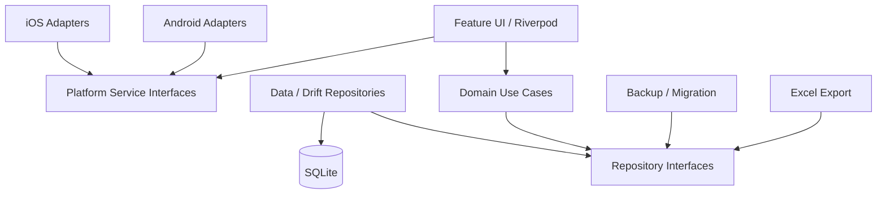

# 记账统计：双端重构技术方案 V1

> 文档版本：V1.0
> 编制日期：2026-08-01
> 文档状态：技术决策草案，可进入评审
> 目标平台：Android、iOS
> 推荐路线：Flutter 单代码库重构

---

## 执行摘要

当前项目是一套约 7,000 行 Kotlin 主代码的 Android 原生离线记账应用，已经具备记账、明细、图表、年度账单、预算、分类、应用锁、加密备份与 Excel 导出等主要功能。现有实现适合作为产品原型和业务行为基线，但还不是可以直接面向 Android、iOS 双端发布的生产工程。

本方案比较三条重构路线：

1. **Flutter 单代码库重写**：推荐。双端共用 UI、业务和数据层，开发与维护成本最低，适合 1-2 人团队和当前产品规模。
2. **Kotlin Multiplatform + Compose Multiplatform**：备选。能够保留较多 Kotlin/Compose 资产，但 iOS 工程化、平台能力封装和长期人才供给风险高于 Flutter。
3. **Android Compose + iOS SwiftUI 双原生**：高预算路线。平台体验最好，但开发、测试和持续维护成本最高。

V1 建议采用 **Flutter + Riverpod + Drift/SQLite + 平台服务适配层**，保持离线优先，不在第一期加入账号、云同步和服务端。重构工作的第一优先级不是重画界面，而是建立稳定的数据模型、跨平台备份格式、可回滚迁移链路和双商店发布流水线。

在一名熟悉移动端的全职开发者条件下，推荐路线预计需要 **18-24 个日历周**；两名开发者并行可压缩到约 **12-16 周**。若当前应用尚无真实存量用户，可以跳过“桥接版本”并减少约 2-3 周。

## 项目现状基线

### 已确认的技术现状

| 范畴 | 当前状态 |
|---|---|
| 客户端 | 单模块 Android 原生应用 |
| 语言与 UI | Kotlin 1.9.24、Jetpack Compose、Material 3 |
| 架构 | Screen -> ViewModel -> Repository -> Room/DataStore |
| 数据库 | Room/SQLite，`books`、`categories`、`transactions` 三张主表 |
| 设置数据 | Preferences DataStore，保存锁设置、自动备份、总预算和预算项 JSON |
| 安全 | Android Keystore、EncryptedSharedPreferences、PBKDF2、AES-256-GCM、生物识别 |
| 文件能力 | MediaStore、SAF、FileProvider、系统分享 |
| 后台任务 | WorkManager 每日备份 |
| 网络与服务端 | 无 HTTP API、无登录、无云同步、无推送、无广告、无统计 SDK |
| 测试 | 3 个单元测试，仅覆盖备份加密和 Excel 文件结构 |
| 发布产物 | 仅有 debug APK，无 release AAB、签名配置和 CI/CD |
| iOS | 无 iOS 工程、Swift/SwiftUI、Bundle ID 或 TestFlight 配置 |

### 必须在重构中解决的问题

- 现有备份只包含 Room 数据库，不包含 DataStore 中的总预算、预算项和设置。
- 恢复时直接替换仍由 Room 持有的数据库文件，缺少关闭连接、完整性校验、原子回滚和兼容性验证。
- 分类采用物理删除，但交易外键为 `RESTRICT`；删除已使用分类可能失败，界面提示与数据模型不一致。
- 数据库 `exportSchema=false` 且没有正式 Migration，无法支撑上线后的连续升级。
- 应用锁初始状态为未锁定，异步加载设置后才锁定，冷启动存在短暂数据暴露窗口。
- Gradle Wrapper 指向本机绝对路径，项目没有 Git、README、CI、自动化测试和可复现构建环境。
- UI 文案硬编码，暗色主题没有真正启用，可访问性与多语言没有系统建设。
- 当前 `targetSdk=34`，不满足 2026 年新应用发布要求。

## 重构目标与非目标

### V1 目标

- 用一套可持续维护的工程交付 Android 与 iOS。
- 保留现有用户的交易、分类、预算和设置数据，迁移失败时可安全回滚。
- 建立版本化数据库 Schema 和跨平台加密备份格式。
- 保留并重做现有全部核心功能，不因重构降低可用性。
- 建立应用锁、设备安全存储、生物识别和敏感页面保护。
- 建立单元测试、数据库测试、迁移测试、关键 UI 测试和发布门禁。
- Android 使用正式 AAB 发布；iOS 通过 TestFlight 和 App Store 发布。
- 默认保持离线优先，不收集财务明细，不依赖网络即可完成核心操作。

### V1 明确不包含

- 用户注册、登录和多设备云同步。
- 银行卡自动导入、短信识别、票据 OCR。
- 资产负债、投资、借贷、报销审批等大型财务模块。
- 多人共享账本、社交、广告和会员订阅。
- Web 管理后台。
- 多币种换算；V1 仅在数据模型中预留币种字段。

这些功能必须作为 V2/V3 单独立项，不能在双端重构期间顺带扩张范围。

## 技术路线比较

### 路线 A：Flutter 单代码库重构（推荐）

#### 目标技术组合

- Flutter Stable / Dart。
- Riverpod：状态管理和依赖装配。
- Drift + SQLite：结构化数据、查询和版本迁移。
- go_router：类型化路由与深链入口。
- flutter_secure_storage：封装 Keychain / Android Keystore。
- local_auth：Face ID、Touch ID、Android 生物识别。
- 平台适配层：Android WorkManager、iOS BGTaskScheduler、文件选择、分享和安全窗口。
- 自研或经过验证的 Excel 导出模块；继续以“分”为整数单位处理金额。

第三方包在正式锁版本前必须完成最小 POC、维护活跃度和许可证审查，文档中的包名代表技术方向而非永久绑定。

#### 优点

- 80%-90% 的新代码可在 Android 和 iOS 之间共享。
- 页面、交互、状态、业务规则和测试基本只实现一次。
- 对当前约 7,000 行规模的应用，完整重写成本仍可控。
- 插件生态和双端发布经验较成熟，适合小团队长期维护。
- UI 一致性高，后续新增功能的双端同步成本低。

#### 缺点与约束

- 现有 Kotlin/Compose 代码无法直接编译复用，多数只能复用业务规则、SQL、视觉和测试用例。
- iOS 后台任务受系统调度限制，不能承诺每天固定时刻执行自动备份。
- 生物识别、安全窗口、文件存储和后台任务仍需少量原生桥接。
- 需要重新建立 Dart 团队能力。

#### 适用判断

当团队为 1-2 人、要求双端功能一致、无重度原生动画或复杂系统扩展时，本路线综合成本最低。

### 路线 B：Kotlin Multiplatform + Compose Multiplatform

#### 目标技术组合

- Kotlin Multiplatform 共享 domain、data、backup、export。
- Compose Multiplatform 共享主要页面和设计系统。
- SQLDelight 或 Room KMP 管理 SQLite。
- Coroutines/Flow 作为异步和状态基础。
- Koin 或显式依赖装配，替换 Android 专属 Hilt。
- expect/actual 或接口适配 Keychain、Keystore、生物识别、后台任务和文件系统。

#### 优点

- 可以复用 MoneyUtils、DateTimeUtils、备份加密、导出逻辑、数据模型和部分 Compose UI。
- 保持 Kotlin 技术栈，Android 团队学习成本较低。
- 可选择共享 UI，也可让部分 iOS 页面使用 SwiftUI。
- 对需要深度原生能力的模块，平台边界较明确。

#### 缺点与约束

- Hilt、WorkManager、MediaStore、BiometricPrompt 等现有代码仍不能直接进入共享层。
- iOS 构建、调试、崩溃排查和依赖兼容复杂度高于 Flutter。
- Compose Multiplatform 在 iOS 的输入法、可访问性、导航和系统交互必须通过真机验证。
- 共享 UI 与 SwiftUI 混用会增加状态桥接和设计一致性成本。
- 招聘与交接风险高于 Flutter 或双原生。

#### 适用判断

当团队已经具备 Kotlin Multiplatform 经验，且“保留 Kotlin/Compose 投资”比“降低工程风险”更重要时，可以选择本路线。

### 路线 C：Android Compose + iOS SwiftUI 双原生

#### 目标技术组合

- Android：保留并现代化 Kotlin、Compose、Room、Hilt。
- iOS：Swift、SwiftUI、GRDB/SQLite、Keychain、LocalAuthentication、BGTaskScheduler。
- 两端共享数据规范、备份协议、接口文档、测试向量和设计系统，不共享 UI 源代码。

#### 优点

- 平台体验、性能、可访问性和系统集成能力最佳。
- Android 可以最大程度保留现有 UI 与工程资产。
- iOS 能够完全遵循 Apple 设计和生命周期规则。
- 第三方跨平台框架风险最低。

#### 缺点与约束

- 业务、UI、测试和缺陷修复通常需要实现两次。
- 至少需要 Android、iOS 两种稳定能力，单人维护风险非常高。
- 双端行为容易长期漂移。
- 成本通常是 Flutter 的 1.6-2.0 倍。

#### 适用判断

适用于有独立双端团队、重视顶级原生体验、预算充足且能够长期承担双份维护成本的项目。

## 路线评分与决策

评分采用 1-5 分，5 分最佳；权重基于当前“小团队、离线记账、双端一致”的项目条件。

| 决策维度 | 权重 | Flutter | KMP/Compose | 双原生 |
|---|---:|---:|---:|---:|
| 双端一致性与共享比例 | 25% | 5.0 | 4.0 | 2.0 |
| 现有 Kotlin/Compose 代码复用 | 15% | 2.0 | 4.0 | 3.0 |
| iOS 成熟度与平台体验 | 15% | 5.0 | 3.5 | 5.0 |
| 开发与迭代效率 | 20% | 5.0 | 4.0 | 2.0 |
| 安全、文件、后台能力接入 | 10% | 4.0 | 3.5 | 5.0 |
| 人才、生态与交接 | 10% | 5.0 | 3.0 | 4.0 |
| 长期框架与维护风险 | 5% | 4.0 | 3.5 | 5.0 |
| **加权总分** | **100%** | **4.40** | **3.75** | **3.25** |

### V1 决策

选择 **Flutter 单代码库重构**，理由如下：

- 当前项目代码量仍小，完整重写的机会成本可控。
- UI 和业务并不依赖重度平台专属能力，跨平台收益明显。
- 项目最大的风险是数据迁移、备份和发布工程，而不是渲染性能。
- 单代码库更适合后续持续开发和双端同步上线。

以下任一条件成立时，应重新评估 KMP：团队已经拥有成熟 KMP 项目经验；必须最大化 Kotlin 源码复用；未来大量功能依赖 Kotlin SDK。以下条件成立时，应重新评估双原生：已经确定配置独立 Android/iOS 团队，或者产品目标升级为对原生交互、系统扩展和无障碍体验要求极高的金融产品。

## 可复用资产清单

### 跨三条路线都可以复用

- 产品信息架构：明细、图表、发现、我的、记账主流程。
- 业务规则：金额按分存储、收支类型、月度范围、日/月统计、预算计算。
- 数据模型语义和现有 SQL 查询。
- 分类名称、图标映射、预置预算项和默认账本规则。
- 备份文件 V1 的 `LGBK` 头、PBKDF2、AES-GCM 算法规范和测试向量。
- Excel 三张工作表的字段、排序、汇总与转义规则。
- 现有页面作为视觉与交互验收基线。
- 当前 APK 作为回归测试参照物。

### 各路线预计直接源码复用率

| 资产 | Flutter | KMP/Compose | 双原生 |
|---|---:|---:|---:|
| Kotlin 业务工具与模型 | 0%-10% | 70%-90% | Android 90%，iOS 0% |
| Room DAO/SQL | SQL 可复用，代码重写 | 40%-70% | Android 80%，iOS 仅 SQL/规范 |
| Compose 页面 | 0%，作为 UI 基线 | 40%-65% | Android 80%-95%，iOS 0% |
| Hilt/ViewModel | 0%-10% | 20%-40% | Android 70%-90%，iOS 0% |
| 加密与备份 | 算法/测试向量复用 | 60%-80% | 算法与格式复用 |
| Excel 导出 | 字段和算法复用 | 70%-90% | 规则复用，两端实现 |
| 综合直接源码复用 | 10%-20% | 45%-65% | 20%-35% |
| 产品行为与规格复用 | 70%-85% | 80%-90% | 80%-90% |

百分比为架构估算值，必须在 POC 后校准，不能作为合同式承诺。

## Flutter 目标架构

### 仓库结构

```text
apps/
  mobile/                 # Android / iOS 壳、flavor、路由入口
packages/
  app_shell/              # 启动、锁屏、导航、生命周期
  design_system/          # 颜色、字体、间距、组件、图标
  domain/                 # 实体、值对象、用例、仓储接口
  data/                   # Drift 数据库、DAO、仓储实现、迁移
  feature_transactions/   # 记账、编辑、明细、搜索
  feature_statistics/     # 趋势、分类排行、账单
  feature_budget/         # 总预算、预算项、预算统计
  feature_categories/     # 分类维护和排序
  feature_security/       # PIN、应用锁、生物识别
  backup/                 # 备份 V2、恢复、兼容 V1
  export/                 # Excel 导出
  platform_services/      # 文件、分享、后台任务、安全窗口
  observability/          # 隐私受控的日志、崩溃与诊断
  testing/                # Fixture、Fake、Golden、迁移测试工具
tools/
  legacy_migration/       # Android 原生桥接迁移与数据校验
docs/                     # 架构、数据字典、发布和隐私文档
```

### 依赖方向



约束：`domain` 不依赖 Flutter、数据库或平台 API；feature 不直接访问 SQLite；Android/iOS 原生代码只能存在于 `apps/mobile` 或 `platform_services` 适配层。

### 核心模块职责

| 模块 | 主要职责 | 关键测试 |
|---|---|---|
| domain | 金额、账本、交易、分类、预算实体和用例 | 纯单元测试，业务分支覆盖 |
| data | Drift Schema、DAO、仓储、事务、迁移 | 数据库集成、Schema 升级 |
| app_shell | 冷启动、应用锁、导航、生命周期 | 启动锁屏、前后台切换 |
| transactions | 增删改查、筛选、月度分组 | ViewModel/Provider 与 UI 流程 |
| statistics | 日/月统计、趋势、Top 分类 | SQL 与纯算法对账 |
| budget | 总预算、预算项、多分类归集 | 边界金额与跨月测试 |
| security | PIN、密钥、失败限制、生物识别 | 错误次数、重启、密钥失效 |
| backup | 加密容器、保留策略、恢复与回滚 | 跨平台测试向量、损坏文件 |
| export | 明细、分类、日汇总 Excel | Excel 结构、转义、大数据量 |
| platform_services | 文件、分享、后台、安全窗口 | Android/iOS 真机集成测试 |

## 数据模型 V2

### 建议实体

| 实体 | 关键字段 | 说明 |
|---|---|---|
| Ledger | id(UUID)、name、currencyCode、createdAt | V1 先使用单账本，但不再写死 ID=1 |
| Category | id(UUID)、legacyId、type、name、iconCode、sortOrder、enabled | 支持迁移旧 Long ID |
| Transaction | id(UUID)、legacyId、ledgerId、categoryId、type、amountMinor、occurredAtUtc、timeZoneId、note、deletedAt | 金额继续使用 Int64 最小货币单位 |
| Budget | id(UUID)、ledgerId、name、amountMinor、monthRule、preset | 总预算也作为一条预算记录处理 |
| BudgetCategory | budgetId、categoryId | 取代 DataStore 中的 categoryIds JSON |
| AppSetting | key、typedValue、updatedAt | 仅保存非秘密设置 |
| MigrationLog | id、fromVersion、toVersion、startedAt、completedAt、resultHash | 保证迁移可追踪、幂等 |

### 数据规则

- 金额统一使用有符号 64 位整数，不使用 `double` 进行持久化和汇总。
- 账本保存 `currencyCode`，V1 默认 `CNY`，不做跨币种换算。
- 时间保存 UTC 毫秒和记账时区 ID，展示和分组使用原始记账时区，避免换时区后账单日期漂移。
- 新数据主键使用 UUID；旧 Room Long ID 写入 `legacyId`，便于核对与回滚。
- 分类不能直接物理删除：有历史交易时改为禁用；无引用时才允许永久删除。
- 软删除必须对应恢复或清理策略，不能只保留不可见垃圾数据。
- 所有 Schema 变更必须有版本号、迁移脚本、Fixture 和升级/降级说明。

## 跨平台备份格式 V2

### 容器设计

- 扩展名：`.ledgerbackup`。
- 文件头：Magic、容器版本、KDF 参数、盐、Nonce、密文长度。
- 密钥派生：PBKDF2-HMAC-SHA256，随机盐，迭代参数写入文件头；以目标设备 300-500ms 解锁耗时进行基准校准，最低参数由安全评审确定。
- 数据加密：AES-256-GCM，每个备份使用随机数据密钥与随机 Nonce。
- 压缩内容：`manifest.json`、`ledgers.json`、`categories.json`、`transactions.jsonl`、`budgets.json`、`settings.json`、`checksums.json`。
- 明确不备份：PIN、Face ID/Touch ID 授权、设备 Keystore/Keychain 密钥、应用锁会话。
- 恢复后要求用户重新配置本机 PIN 和生物识别。

### 恢复门禁

1. 先在内存或临时目录完成解密，不覆盖当前数据库。
2. 校验 Magic、容器版本、GCM 标签、文件 Hash 和记录数量。
3. 解析到临时数据库并执行外键、唯一性、金额和日期范围校验。
4. 输出迁移摘要：账本、分类、交易、预算数量及收支总额。
5. 用户确认后执行原子切换；保留旧数据库的设备加密回滚副本。
6. 新库成功启动并完成健康检查后再删除临时文件。

## 现有数据迁移方案

### 场景一：已有真实 Android 用户（推荐两阶段迁移）

#### 桥接版本 A：现有 Kotlin 应用

- 修复现有分类删除、应用锁和备份问题。
- 开启 Room Schema 导出并冻结旧数据库 V1 结构。
- 增加“迁移包导出”，同时读取 Room、DataStore 和非秘密设置。
- 生成跨平台 V2 备份，并完成 V1 -> V2 对账。
- 提醒用户至少完成一次迁移备份。
- 上线后保留 2-4 周，确认迁移包覆盖率和错误率。

#### 替换版本 B：Flutter 应用

- 保持原 `applicationId` 和正式签名，作为同一应用升级。
- 首次启动通过 Android 原生迁移桥读取旧 Room/DataStore，或导入桥接版本生成的 V2 包。
- 创建设备加密的旧数据回滚快照，默认保留 7 天。
- 事务性导入 V2 Schema；按记录数、分类数、月度收支总额进行对账。
- 迁移成功后展示摘要，失败则继续启动旧数据保护页并允许重试/导出诊断。

### 场景二：尚无真实用户

- 不发布桥接版本。
- 保留 V1 加密备份导入器和一组真实 Fixture 即可。
- 直接建立 V2 Schema，现有 APK 只作为功能回归基线。

### iOS 换机迁移

iOS 无法直接读取 Android 应用私有目录。用户必须通过 `.ledgerbackup` 文件、AirDrop、系统文件、网盘或其他用户主动选择的方式导入。不得把“自动跨端同步”作为离线 V1 的承诺。

### V1 旧备份的已知限制

旧 `.zip.enc` 备份只含 SQLite 数据库，不含 DataStore，因此仅凭旧文件无法恢复总预算、预算项和部分设置。迁移界面必须如实提示，不得显示“已恢复全部数据”。

## 安全方案

- 数据库静态加密：优先验证 SQLCipher/等价方案在 Flutter、Android、iOS 和 Drift 下的稳定性；若 POC 不通过，至少使用系统文件保护、设备密钥、`allowBackup=false` 和严格导出边界。
- 本机数据库密钥保存在 Android Keystore / iOS Keychain，不硬编码、不进入日志和备份。
- 应用锁状态在绘制任何账单 UI 前同步确定，避免冷启动闪现。
- PIN 使用慢哈希和随机盐；连续失败采用指数退避，退避状态持久化，不能通过重启绕过。
- 生物识别只解锁本机密钥，不替代备份密码。
- Android 使用安全窗口；iOS 在进入后台时覆盖敏感快照。
- 日志禁止记录金额、备注、密码、密钥、完整文件路径和备份内容。
- 恢复文件设置大小上限、字段长度上限和压缩炸弹防护。
- 发布签名、上传密钥、证书和 API Token 仅保存在密码管理器或 CI Secret 中。

## UI、设计系统与可访问性

- 保留“明细 / 图表 / 发现 / 我的 + 中央记账按钮”的主信息架构。
- 建立颜色、字体、圆角、阴影、间距和金额语义色 Token。
- 支持浅色、深色和跟随系统。
- 全部文案资源化，首发简体中文；代码结构支持后续英文和繁体中文。
- 金额、日期、时间和数字使用 Locale 格式化，不拼接硬编码字符串。
- 支持系统字体缩放、屏幕阅读器、对比度、触控目标和键盘安全类型。
- 关键页面建立 Golden/Snapshot 测试，Android 与 iOS 允许平台字体和控件存在受控差异。

## 测试与质量门禁

### 自动化测试层级

- Domain 单元测试：金额、日期、预算、筛选、统计、软删除规则。
- 数据库测试：DAO、事务、外键、索引、10 万条交易性能。
- Migration 测试：每个历史版本到当前版本；重复执行必须幂等。
- Backup 测试：Android 生成/iOS 恢复、iOS 生成/Android 恢复、错误密码、截断、篡改、超大文件。
- Provider/ViewModel 测试：加载、保存、错误、并发、恢复。
- Widget/Golden 测试：主页面、空状态、暗色、大字体、长文案。
- E2E：首次启动、记账、编辑、删除、筛选、预算、导出、备份、恢复、应用锁。
- 真机测试：至少一台低端 Android、一台当前 Android、一台小屏 iPhone、一台当前主流 iPhone。

### 发布指标

| 指标 | V1 门槛 |
|---|---|
| 核心业务单元测试覆盖率 | 不低于 80% |
| 数据迁移 Fixture | 100% 通过，记录数与月度总额一致 |
| P95 冷启动 | 中端设备不高于 2 秒，锁屏路径不泄露内容 |
| 10 万交易月度查询 | 中端设备不高于 500ms |
| Crash-free users | 灰度期不低于 99.8% |
| P0/P1 缺陷 | 发布前为 0 |
| 备份跨端恢复 | 双向真实设备通过 |

## 开发阶段与周期

以下估算以 1 名熟悉 Flutter、Android 基础良好、可使用 Mac 完成 iOS 开发的全职工程师为基准，不含大规模视觉改版和云同步。

| 阶段 | 主要交付 | 工期 |
|---|---|---:|
| P0 基线与决策 | Git、README、现状测试、数据字典、POC、锁定技术栈 | 1-2 周 |
| P1 数据与迁移 | V2 Schema、备份 V2、V1 导入器、桥接方案 | 2-3 周 |
| P2 工程骨架 | Flutter Monorepo、Riverpod、Drift、路由、设计系统、CI | 2 周 |
| P3 核心业务 | 记账、编辑、明细、筛选、分类、统计、账单 | 4-5 周 |
| P4 预算与平台能力 | 预算、锁屏、生物识别、文件、Excel、后台任务 | 3-4 周 |
| P5 安全与迁移验证 | 加密、失败限制、原子恢复、性能与安全测试 | 2-3 周 |
| P6 Beta 与商店准备 | 真机回归、TestFlight、Play 内测、隐私材料、截图 | 3 周 |
| P7 灰度上线 | 修复、分阶段发布、监控和回滚演练 | 1-2 周 |
| **总计** | **Flutter 推荐路线** | **18-24 日历周** |

### 三条路线总体周期

| 路线 | 人力投入估算 | 1 人日历周期 | 2 人并行日历周期 |
|---|---:|---:|---:|
| Flutter | 16-20 人周 | 18-24 周 | 12-16 周 |
| KMP/Compose | 18-24 人周 | 22-30 周 | 14-18 周 |
| 双原生 | 28-36 人周 | 32-44 周 | 18-24 周 |

估算需要在 P0 POC 完成后重新基线化。兼职开发、首次学习 Flutter/KMP、没有 Mac、设计稿未确定或新增云同步都会显著延长周期。

## CI/CD 与版本管理

### 仓库与分支

- 立即初始化 Git，主分支启用保护规则。
- 使用短分支 + Pull Request；至少一项自动化检查通过后才能合并。
- 使用 Conventional Commits 或等价规范生成变更记录。
- 应用版本采用 `major.minor.patch+build`，Android `versionCode`、iOS `CFBundleVersion` 由 CI 单调递增。

### 默认流水线

- GitHub Actions 作为默认 CI；如网络或合规条件不适合，可替换为自托管 GitLab/Jenkins。
- Android 使用 Linux Runner：格式化、静态检查、测试、构建签名 AAB、上传 Play 内测。
- iOS 使用 macOS Runner：测试、Archive、签名、上传 TestFlight。
- Fastlane 统一管理商店元数据、截图、测试组和分阶段发布。
- 签名材料不进入仓库；使用 CI Secret、Match/证书库或企业密码管理器。

### 环境

- `dev`：本地开发，可启用调试菜单和 Fixture。
- `staging`：候选版本、迁移演练、内测，不读取生产用户文件。
- `prod`：正式包名、正式签名、最小日志、隐私配置锁定。

即使 V1 没有服务端，也应保留 flavor，以隔离调试能力、包名、日志和未来接口配置。

## Android 发布流程

1. 冻结正式 `applicationId` 和签名策略；如承接现有用户，必须使用原包名和原签名。
2. 升级 compile/target API，按 2026-08-31 之后发布的目标直接适配 API 36。
3. 构建 `release.aab`，启用混淆/资源压缩并保存 mapping。
4. 配置 Play App Signing，妥善保存独立上传密钥。
5. 完成隐私政策、Data Safety、内容分级、应用访问说明、商店图文和支持邮箱。
6. Internal Testing 验证安装、升级、迁移和签名。
7. Closed Testing 运行至少 2 周，覆盖真实设备与存量数据。
8. Production 采用 5% -> 20% -> 50% -> 100% 灰度；每档至少观察 24-48 小时。
9. 指标异常时停止灰度，不通过降低 `versionCode` 回滚，而是发布修复版本并保护数据兼容。

## iOS 发布流程

1. 准备 Apple Developer 账号、证书、App ID 和正式 Bundle ID。
2. 使用 Xcode 26 或更高版本、iOS 26 SDK 构建和归档。
3. 配置 Keychain、Face ID Usage Description、文件访问、后台任务和隐私清单。
4. 完成 App Privacy、隐私政策 URL、年龄分级、商店截图、审核说明和支持 URL。
5. 通过 TestFlight Internal Group 完成开发验收。
6. TestFlight External Group 运行至少 1-2 周；重点验证文件导入导出、后台恢复、锁屏快照和大字体。
7. 提交 App Review；审核备注明确说明财务数据仅在本地保存，以及备份由用户主动控制。
8. 选择手动发布或分阶段发布；保留上一个兼容数据版本的热修复能力。

## 隐私与合规交付物

- 隐私政策网页：说明本地处理、备份文件、崩溃信息、权限和用户删除方式。
- Google Play Data Safety 表。
- App Store App Privacy 表及 `PrivacyInfo.xcprivacy`。
- 权限使用清单和第三方 SDK 数据行为台账。
- 加密与密钥管理说明。
- 用户数据导出、删除、备份和恢复说明。
- 中国大陆 Android 渠道如需发布，应按最终渠道和主体另行核对 APP 备案、隐私合规、软件著作权、SDK 合规和各商店材料；本方案不把法律判断写死在技术实现中。

## 上线与回滚策略

- 迁移前自动生成设备加密的回滚快照，保留 7 天或直到用户确认。
- 新版本首次启动完成数据库健康检查后才标记迁移成功。
- 新 Schema 只做向前兼容；发布后不得让旧版本继续写入已升级数据库。
- 灰度指标包括启动崩溃、迁移失败、备份失败、恢复失败、数据库错误和锁屏绕过。
- 崩溃/诊断不得包含金额、备注、分类明细或备份内容。
- 发现数据风险时立即停止灰度，优先发布“只读保护/导出工具”，而不是继续自动迁移。

## 风险登记

| 风险 | 等级 | 缓解措施 | 关闭节点 |
|---|---|---|---|
| 数据迁移导致丢账或重复 | 极高 | 桥接版本、幂等迁移、数量与金额对账、回滚快照 | P5 |
| 旧备份缺少预算与设置 | 高 | 明示限制；桥接版本生成完整 V2 备份 | P1 |
| iOS 后台备份不准时 | 高 | 文案改为“系统允许时自动备份”；提供手动备份和最近成功时间 | P4 |
| 跨平台加密实现不一致 | 高 | 固定二进制测试向量，Android/iOS 双向恢复 | P5 |
| Flutter 插件停更或权限变化 | 中 | P0 POC、封装平台接口、避免业务直接依赖插件 | P0/P4 |
| 包名或签名丢失导致无法升级 | 极高 | P0 冻结身份，密钥备份与权限分离 | P0 |
| 双端 UI/统计结果漂移 | 中 | 单代码库、Golden、同一 SQL 和 Fixture | 持续 |
| 重构期间需求扩张 | 高 | V1 非目标清单、变更评审、延期而非暗加范围 | 持续 |
| 无 Mac 阻塞 iOS | 高 | P0 即准备 Mac、开发者账号和真机 | P0 |

## 里程碑验收

### M0：技术 POC 通过

- Flutter Android/iOS 能打开同一个加密数据库。
- 两端能用同一 `.ledgerbackup` 相互恢复。
- 生物识别、文件分享、Excel 导出和后台任务完成最小验证。
- 决定数据库是否启用 SQLCipher。

### M1：数据层冻结

- V2 数据字典、Schema、索引、迁移矩阵评审完成。
- 旧 APK Fixture 可以迁移，数量与金额完全一致。
- 备份恢复具备损坏检测和回滚。

### M2：核心功能完成

- 现有记账、明细、图表、账单、预算、分类功能全部通过验收。
- Android/iOS 关键路径一致，暗色和大字体可用。

### M3：Release Candidate

- 自动化测试、真机矩阵、性能、安全、隐私和商店材料全部通过。
- Android AAB、iOS Archive 可由 CI 重复生成。
- P0/P1 缺陷为 0。

### M4：双端上线

- Play 灰度达到 100%。
- App Store 正式版本可用。
- 迁移、崩溃和备份指标稳定至少 7 天。
- 完成发布复盘和 V2 需求重新排期。

## 立即执行的前 10 项任务

1. 初始化 Git，提交当前源码和 APK 哈希基线。
2. 修复 Gradle Wrapper 和 Java 17 环境，保证全新电脑一条命令构建。
3. 确认是否存在真实用户、正式包名和可用签名密钥。
4. 为现有 Room V1 导出 Schema，建立真实匿名 Fixture。
5. 修复分类删除、应用锁冷启动和备份不完整问题。
6. 用 Flutter 完成 Drift、Keychain/Keystore、双向加密备份 POC。
7. 确认 SQLCipher 可行性与性能；形成书面决策。
8. 冻结 V2 数据字典和 `.ledgerbackup` 协议。
9. 建立 Monorepo、静态检查、单测和 Android/iOS CI 骨架。
10. 按“现有功能等价”建立验收清单和迁移对账脚本。

## 需要业务方确认的开放决策

- 当前 APK 是否已经发给真实用户，是否必须无损原地升级。
- 正式包名是否继续使用 `com.offline.ledger`，以及签名密钥是否存在。
- 是否接受 Flutter 作为主技术栈。
- V1 是否必须支持多账本、多币种或仅保留数据预留。
- 是否启用匿名崩溃监控；若启用，选择服务商并更新隐私披露。
- 首发商店范围：Google Play、App Store、中国大陆 Android 商店或企业分发。
- 是否已有品牌名、图标、隐私政策域名、支持邮箱和开发者主体。

## 参考资料

- Google Play Target API Level Requirements：<https://support.google.com/googleplay/android-developer/answer/11926878>
- Google Play Android App Bundle：<https://support.google.com/googleplay/android-developer/answer/9844679>
- Google Play Data Safety：<https://support.google.com/googleplay/android-developer/answer/10787469>
- Apple Upcoming Requirements：<https://developer.apple.com/news/upcoming-requirements/>
- Apple App Privacy：<https://developer.apple.com/help/app-store-connect/manage-app-information/manage-app-privacy/>
- Apple Privacy Manifest：<https://developer.apple.com/documentation/bundleresources/privacy-manifest-files>

---

**V1 推荐结论：采用 Flutter 单代码库重构；先完成数据、备份和迁移 POC，再进入页面重写。若 P0 阶段证明关键插件、SQLCipher 或 iOS 体验不能满足验收门槛，立即转入 KMP 备选评审，而不是在实现中期被动切换。**
